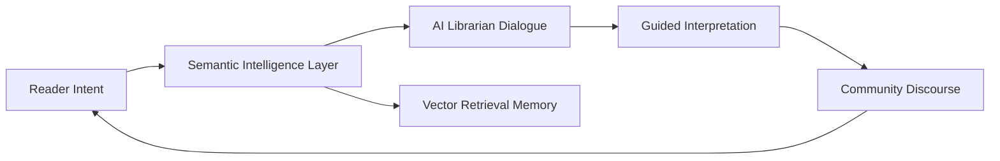
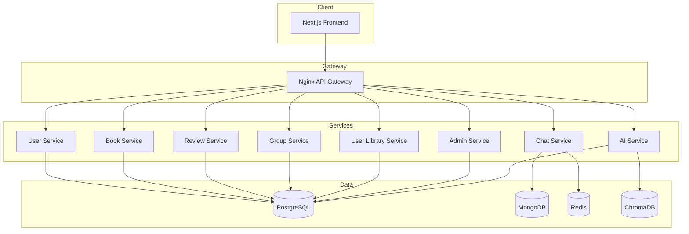
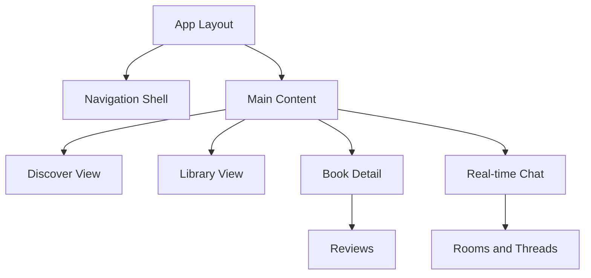
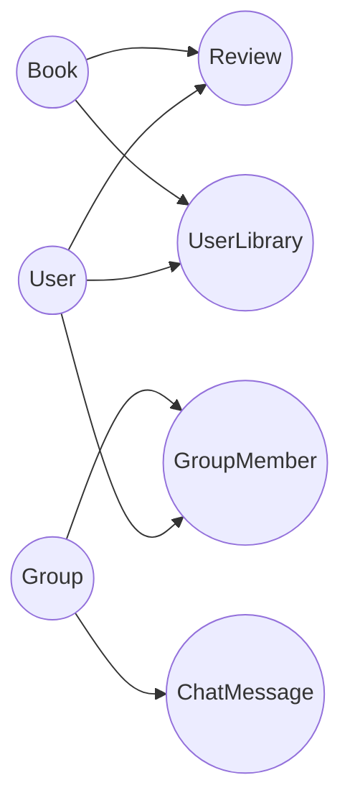
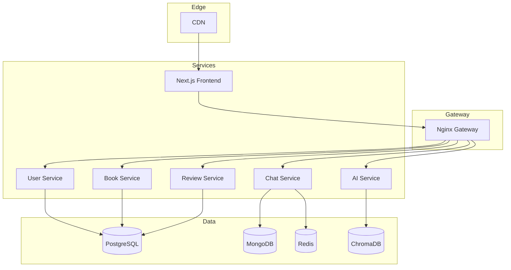
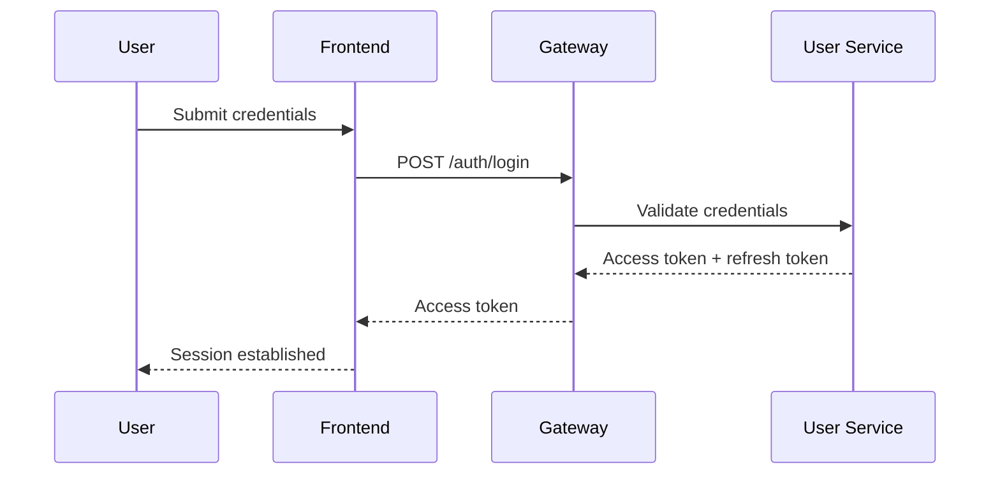
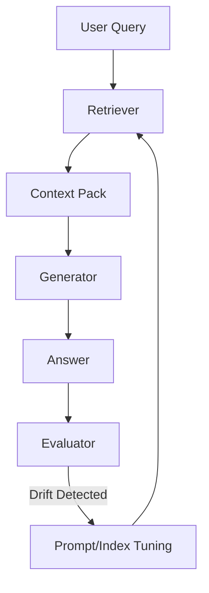

<strong>SHELFSPACE: INTELLIGENT BOOK MANAGEMENT SYSTEM</strong>

<strong>Comprehensive Engineering Review Report</strong>

Harshvardhan Amrelliya — Lead AI Architect & Data Scientist

Divyansh Karan — Lead Backend Systems Engineer

Viral Vaghela — Lead Frontend & UI Engineer

Ritvik Anand — Frontend & Real-Time Systems Engineer

Janmeyja Mishra — Frontend & UX Engineer

February 7, 2026

[INSERT COVER IMAGE: Cyberpunk Library — see mermaid/nano_banana_ai_prompt.txt]

<strong>TABLE OF CONTENTS</strong>

Chapter 1: Introduction 
Chapter 2: Literature Review 
Chapter 3: System Architecture 
Chapter 4: Implementation 
Chapter 5: Ethical Considerations 
Chapter 6: Team Contributions 
Chapter 7: Future Roadmap 
Chapter 8: Conclusion 
References 
Publications

<strong>LIST OF FIGURES</strong>

Figure 1.1 Conceptual AI Vision of the Cyberpunk Library Interface 
Figure 2.1 High-Level Microservices Architecture Overview 
Figure 2.2 AI RAG Pipeline and Vector Retrieval Flow 
Figure 3.1 Frontend Component and State Hierarchy 
Figure 3.2 System Deployment and Container Orchestration 
Figure 3.3 Database Entity Relationship Diagram 
Figure 4.1 User Authentication and Security Sequence 
Figure 5.1 Real-Time Collaboration User Flow 
Figure 5.2 RAG Grounding and Evaluation Loop 

<strong>LIST OF ABBREVIATIONS</strong>

API — Application Programming Interface 
AI — Artificial Intelligence 
ANN — Approximate Nearest Neighbor 
CSR — Client-Side Rendering 
ERD — Entity Relationship Diagram 
GDPR — General Data Protection Regulation 
HNSW — Hierarchical Navigable Small World 
IVF — Inverted File Index 
JWT — JSON Web Token 
LLM — Large Language Model 
NLP — Natural Language Processing 
RAG — Retrieval-Augmented Generation 
RSC — React Server Components 
SSR — Server-Side Rendering 
WAF — Web Application Firewall 
WCAG — Web Content Accessibility Guidelines 

<strong>CHAPTER 1: INTRODUCTION</strong>

## 1.1 The Modern Information Paradox

Libraries have long stood as the institutional memory of civilization, evolving from clay tablets and papyrus archives into the codified systems of modern librarianship, and finally into the digitized catalogs that now mediate our relationship with texts. The contemporary reader inhabits a world in which acquisition has been democratized, yet interpretation has become increasingly atomized, and this dissonance is the central paradox that ShelfSpace seeks to resolve. The digital library, for all its convenience, has tended to inherit the limitations of the card catalog rather than transcend them, presenting a taxonomy of titles and authors while deprioritizing the semantic relationships that make literature a living discourse rather than a static inventory. This results in a paradoxical fatigue: when everything is available, discovery can feel directionless, and when reading is abundant, meaning can feel scarce.

The paradox intensifies in the twenty-first century because digital abundance does not automatically yield cognitive coherence. Readers now confront an ever-expanding universe of content filtered through algorithmic feeds that optimize engagement rather than understanding. The fragmentation of discovery, annotation, and discussion into discrete apps introduces a subtle but persistent cognitive tax, forcing the reader to continually switch mental contexts and digital interfaces just to sustain a single line of intellectual inquiry. The outcome is not merely inefficiency but a deeper erosion of reflective attention, which in turn degrades comprehension and discourages the deeper engagement that serious reading requires. In this environment, the library as a concept risks becoming a sterile logistics tool rather than a dialogic space for learning.

ShelfSpace frames this crisis as both a technological and a psychological problem. The technical shortcoming is an absence of semantic intelligence and real-time social context in the core architecture of reading platforms. The psychological shortcoming is the rupture between private interpretation and public validation, a rupture that forces the reader to shuttle between isolated tools in order to complete a single cycle of comprehension. By recognizing that these issues are not separate but mutually reinforcing, ShelfSpace situates its solution at the intersection of information architecture, cognitive ergonomics, and distributed systems design.

## 1.2 The Psychology of Social Reading

Reading is often described as solitary, yet this characterization conflates the physical act of decoding text with the cognitive act of making meaning. In practice, meaning is negotiated through social discourse, and the reader’s internal narrative becomes coherent when it is tested, challenged, and refined through interaction with other readers. Social constructivist theories of learning, combined with empirical research on collaborative cognition, consistently show that memory retention and conceptual clarity improve when readers can articulate their interpretations and receive immediate feedback. In effect, discussion does not merely accompany reading; it constitutes a second-order comprehension mechanism that transforms private interpretation into shared knowledge.

The dissonance of modern reading platforms arises because social interaction is structurally decoupled from the act of reading. Readers track books in one system, discuss them elsewhere, and search for clarification in yet another, which fragments attention and corrodes narrative continuity. This fragmentation creates a subtle cognitive burden, often described as switching cost, that reduces willingness to participate in deeper discussion, and it is this psychological friction that contributes to the hollowing out of the digital reading experience. ShelfSpace names this phenomenon a crisis of reading efficacy, a condition in which access to content fails to translate into understanding or sustained engagement.

ShelfSpace addresses the psychological layer by collapsing the boundaries between reading, reflection, and discussion into a single environment that preserves continuity of thought. Rather than forcing the reader to curate their experience across applications, ShelfSpace integrates the social layer directly into the reading workflow, enabling immediate discussion, contextual referencing, and AI-mediated explanation within the same cognitive space. This architectural decision is not merely a usability improvement but a deliberate alignment with cognitive theory, ensuring that the technology supports, rather than disrupts, the rhythms of human comprehension.

## 1.3 The ShelfSpace Initiative

The ShelfSpace initiative is grounded in the principle that a library should act as an active participant in the intellectual life of its user rather than a passive repository. The project is designed to operate as a conversational partner and a community catalyst, embedding semantic intelligence and real-time discourse into the core fabric of the platform. This philosophy reframes the digital library from a storage paradigm into a participatory knowledge system, where the value is derived not only from access to books but from the interpretive ecosystem that surrounds them.

At the architectural level, ShelfSpace is structured around three interdependent pillars: semantic intelligence, real-time social interaction, and the AI Librarian. Semantic intelligence ensures that discovery is meaning-driven rather than keyword-driven, allowing readers to find works that resonate with complex themes without relying on exact lexical matches. Real-time social interaction restores the immediacy of literary conversation, enabling a book to become a shared event rather than a solitary task. The AI Librarian provides a retrieval-grounded dialogic interface, allowing readers to ask conceptual questions and receive answers anchored in the textual corpus rather than in speculative model hallucinations.

By aligning these pillars, ShelfSpace addresses the full lifecycle of reading: discovery, comprehension, discussion, and synthesis. The system treats the reader as a participant in a dynamic knowledge network rather than as an isolated consumer, and it positions the library as a living system whose intelligence is distributed across algorithms, community, and curated content. In this way, the ShelfSpace initiative is not a mere application but a thesis about how digital literacy can evolve into a more integrated, human-centric paradigm.

[INSERT FIGURE 1.1: Conceptual AI Vision of the Cyberpunk Library Interface]

## 1.4 Existing Project Baseline and Repository Reality

The existing ShelfSpace repository embodies the architectural vision in concrete, deployable form. At the outer boundary, an Nginx gateway performs reverse proxy routing, SSL termination, and uniform ingress control, translating a conceptual pattern into operational discipline. This gateway aligns with the API Gateway pattern and explicitly separates the user-facing contract from the internal service topology, allowing the platform to evolve without destabilizing the public interface. The current Docker Compose configuration orchestrates a mesh of services that together form the operational substrate of the system, establishing a coherent baseline against which future evolution can be measured.

The backend microservices are segmented by domain rather than by technical layer, with discrete services for user management, book handling, reviews, groups, chat, administration, and the user library. This segmentation reflects a deliberate embrace of bounded contexts in the sense of domain-driven design, ensuring that each service encapsulates its own data model and evolution path. PostgreSQL underpins the relational core where integrity, referential constraints, and transactionality are paramount, while MongoDB stores high-volume conversational data that benefits from document flexibility. Redis provides ephemeral state, caching, and pub/sub messaging, which becomes essential when scaling real-time communication beyond a single instance.

The AI subsystem is implemented as a Python service, acknowledging that the ML ecosystem remains Python-first despite the rest of the backend relying on Node.js for concurrency and I/O efficiency. This is not a polyglot indulgence but an explicit optimization of workflow, enabling the team to leverage established libraries in retrieval, embedding generation, and model orchestration. The frontend, built on Next.js 16, anchors the user experience with SSR and React Server Components, ensuring that first render performance and SEO are treated as primary engineering constraints rather than post hoc optimizations. The existing project baseline therefore provides a structurally sound foundation, and the report that follows is a critical analysis of why each architectural decision is coherent, defensible, and aligned with the system’s stated goals.

## 1.5 Research Questions and Engineering Hypotheses

The report is guided by a set of research questions that function as architectural hypotheses rather than purely academic curiosities. The first question asks whether semantic retrieval, implemented through vector search and RAG, can measurably increase the reader’s ability to interpret and complete complex texts. This inquiry is not merely about algorithmic accuracy; it is about the user’s perceived efficacy, which is a composite of comprehension, confidence, and continuity of engagement. The hypothesis is that a retrieval-grounded AI Librarian will reduce cognitive friction by offering immediate conceptual clarification and thematic synthesis without requiring external searches.

A second question concerns the sociotechnical role of real-time discourse in reading. The system posits that synchronous conversation increases motivation and interpretive depth, especially for difficult or emotionally resonant texts. This hypothesis is informed by collaborative learning theory, but it must be operationalized through engineering constraints such as latency, presence signaling, and state consistency across a distributed cluster. The research question therefore becomes whether real-time systems can be engineered in a way that preserves immediacy without creating instability or excessive operational cost.

A third question interrogates the viability of polyglot persistence as a strategic architecture for knowledge systems. The hypothesis is that specialized data stores, when coordinated by a cohesive service layer, outperform monolithic data strategies in both performance and maintainability, especially under heterogeneous workloads. Yet polyglot persistence introduces operational complexity, so the analysis must consider whether the benefits in latency, flexibility, and semantic capability outweigh the costs of coordination and observability. These questions provide the methodological spine of the report, connecting technical decisions to their epistemic rationale.

## 1.6 Scope, Assumptions, and Limitations

The scope of this report is intentionally comprehensive yet bounded. It examines the ShelfSpace system as both a technical artifact and an epistemic platform, but it does not attempt to evaluate the literary canon or to provide empirical user studies beyond the engineering assumptions embedded in the design. The analysis focuses on architectural logic, implementation tradeoffs, and the ethical implications of integrating AI into reading environments, recognizing that rigorous user studies constitute a separate research effort that should follow deployment.

The report assumes a modern deployment environment with container orchestration, secure networking, and standard cloud primitives available. It also assumes a baseline of digital literacy among users, while acknowledging that accessibility features are necessary to broaden inclusivity. The limitations include the inherent uncertainty of AI model behavior over time, the evolving legal landscape of AI and copyright, and the operational challenges of scaling real-time features across diverse network conditions. These limitations are not flaws but boundaries that contextualize the engineering decisions and highlight areas for future empirical validation.

## 1.7 Historical Context: From Alexandria to Algorithmic Libraries

The historical evolution of libraries reveals a recurring pattern: each technological shift expands access while simultaneously introducing new forms of gatekeeping. The Library of Alexandria represented a concentration of knowledge and institutional authority, where access was mediated by political and scholarly hierarchies. The rise of print decentralized access but also created new economic barriers, while the public library movement democratized access further by institutionalizing knowledge as a civic good. In each era, the library functioned as both an archive and a cultural instrument, shaping what knowledge was preserved and how it was disseminated.

The digital transition introduced a new paradigm of algorithmic mediation. Search engines and recommendation systems now shape discovery, often prioritizing engagement metrics over intellectual depth. This creates a subtle shift in the role of the library from curator to indexer, from a place of intentional organization to a system of probabilistic ranking. ShelfSpace positions itself in response to this transformation, aiming to restore intentionality and interpretive depth within a digital environment that otherwise risks privileging immediacy and surface-level engagement.

This historical lens is critical because it reveals that technological innovation alone does not guarantee epistemic progress. The challenge is not merely to digitize access but to preserve the interpretive and communal functions that libraries historically supported. ShelfSpace’s architecture and design choices are therefore framed not as isolated technical decisions but as part of a long lineage of attempts to align knowledge access with human flourishing.

## 1.8 Problem Statement and Design Imperatives

The core problem ShelfSpace addresses is the fragmentation of the reading lifecycle across disconnected tools, which erodes comprehension and weakens community discourse. The modern reader navigates a fractured ecosystem in which tracking, analysis, and conversation are distributed across platforms that rarely communicate with one another. This fragmentation creates an invisible barrier to sustained engagement, producing cognitive fatigue and reducing the likelihood that readers will move beyond superficial interaction with texts.

The design imperative is therefore to unify the reading lifecycle into a single coherent environment that supports discovery, interpretation, and discussion without requiring context switching. This requires not only UI integration but architectural integration, ensuring that social features and AI capabilities are embedded at the core rather than appended as external modules. The system must support both individual and collective reading experiences, preserving private reflection while enabling shared meaning-making.

ShelfSpace’s response is to treat the library as an intelligent, socially activated system rather than as a static repository. This conceptual shift reframes the technical requirements: semantic search becomes a prerequisite rather than a luxury, real-time communication becomes a foundational capability rather than a novelty, and AI-driven interpretation becomes a guided companion rather than a speculative add-on. The problem statement thus informs the system’s architecture at every level, aligning technical decisions with the fundamental goal of restoring depth and continuity to digital reading.

## 1.9 Methodology and Report Structure

The methodology of this report combines architectural analysis, theoretical synthesis, and empirical engineering rationale. Rather than presenting a purely descriptive account of the system, the report interrogates each major design decision in light of established research in software engineering, cognitive science, and human-computer interaction. This approach ensures that the platform is evaluated not only on what it does, but on why its structure is justified given the problem space it inhabits.

The report’s structure mirrors the system’s lifecycle, beginning with historical and theoretical framing, moving through architectural design, and culminating in implementation analysis, ethics, and future direction. This sequence reflects the belief that technology cannot be evaluated in isolation; it must be understood within its cultural and theoretical context, then assessed for technical coherence and ethical responsibility. The narrative is therefore intentionally continuous, building from foundational premises toward practical conclusions.

By organizing the report into chapters that align with architectural layers and sociotechnical considerations, the document functions both as an engineering review and as a scholarly thesis. This duality is deliberate, reflecting the platform’s identity as both a software system and a cultural intervention. The methodology thus serves as a bridge between academic rigor and practical engineering, mirroring the platform’s own synthesis of theory and implementation.

<strong>CHAPTER 2: LITERATURE REVIEW</strong>

## 2.1 The Architectural Shift: Monolith to Microservices

The monolithic architecture historically dominated enterprise software because it aligned with the operational constraints of its era. When deployment environments were limited and automation tooling was immature, a single executable offered simplicity of testing, release, and rollback. Over time, however, the accumulated complexity of feature accretion transformed monoliths into epistemically opaque artifacts, where the cost of change rose exponentially due to tangled dependencies and shared state. The literature on software evolution frames this as entropy: without clear boundaries, systems decay into tightly coupled structures that resist adaptation.

Microservices emerged as a corrective paradigm, reframing architecture around domain segmentation and independent deployment. The core intellectual shift lies in treating system components as autonomous socio-technical units rather than as mere modules within a single binary. This autonomy enables fault isolation, which reduces the blast radius of failures, and it enables independent scalability, allowing hot paths to be scaled without inflating cold paths. The microservices paradigm therefore aligns not only with technical efficiency but with organizational cognition, allowing teams to own specific services as cohesive units of responsibility.

ShelfSpace adopts microservices not as a fashionable choice but as a necessary response to the variability of its workload. Real-time chat, AI inference, and relational transaction processing are computationally distinct tasks with fundamentally different scaling characteristics. A monolith would force these concerns into a shared runtime, creating resource contention and a fragile coupling between operational behaviors. Microservices allow each subsystem to be optimized for its own computational profile, making the overall system more stable and more evolution-ready, even though it introduces non-trivial overhead in observability, service discovery, and deployment orchestration.

[INSERT FIGURE 2.1: High-Level Microservices Architecture Overview]

## 2.2 Comparative Market Analysis

Goodreads occupies a legacy position in the social reading ecosystem and demonstrates the cost of architectural inertia. The platform’s reliance on older monolithic patterns, combined with a slow cadence of feature evolution, illustrates how technical debt can calcify product direction. From a research standpoint, Goodreads is a cautionary case study in the mismatch between scale and agility, where the user base grows but the product’s ability to innovate declines. This creates a paradox: a large community exists, but the experiential quality of the platform stagnates.

StoryGraph, by contrast, reveals a different trajectory, offering a modern UI, data-driven visualizations, and personalization heuristics that appeal to analytically minded readers. Yet its deliberate avoidance of real-time sociality exposes a second-order limitation: data without discourse can become sterile. The platform’s architecture favors analytics but offers limited tools for interpretive community, reinforcing the idea that metrics alone cannot substitute for the social construction of meaning.

ShelfSpace positions itself as a synthesis rather than a replacement. It retains the personalization and interface clarity of modern challengers while reintroducing immediate, low-latency discussion as a core feature rather than a peripheral add-on. The explicit integration of semantic search and AI-mediated explanation differentiates ShelfSpace from incumbents by replacing a purely transactional model of reading with a dialogic and interpretive model. The market analysis thus becomes a blueprint for architectural differentiation, indicating not only what features are missing but why those features must be built into the system’s core ontology rather than layered on at the edges.

## 2.3 Evolution of NLP and the Transformer Inflection

Natural language processing has undergone a series of paradigm shifts, each expanding the computational capacity to model meaning. Early statistical approaches treated language as surface-level co-occurrence, while the neural wave introduced distributed representations that captured latent semantic structure. Recurrent networks and LSTMs offered a workable framework for sequential data but remained constrained by their reliance on stepwise processing, which limited both their scalability and their ability to capture long-distance dependencies. The Transformer architecture altered this trajectory by replacing sequential recurrence with parallel attention, enabling models to build richer contextual embeddings at scale.

The significance of the Transformer is not only computational but epistemological. It allows models to weigh the relevance of tokens across an entire sequence simultaneously, approximating a more holistic reading of text. This capability became the foundation for large language models, which can synthesize, infer, and explain with unprecedented fluency. Yet this fluency masks a core limitation: these models are generative, not evidentiary. They excel at producing coherent text but lack inherent grounding in verifiable sources, which is unacceptable in a knowledge-centric platform where epistemic trust is paramount.

For ShelfSpace, the Transformer revolution provides both an opportunity and a caution. The opportunity is to build an AI librarian capable of contextualizing literature in ways that static search cannot. The caution is that any AI layer must be engineered to avoid hallucination and to defer to textual evidence when claims are made. This tension drives the architectural choice of RAG, which is explored in the next section.

## 2.4 RAG Theory and Epistemic Grounding

Retrieval-Augmented Generation represents a hybrid epistemology in which generative models are constrained by retrieved evidence. The core insight is that knowledge-intensive queries require a mechanism for grounding, and that embedding-based retrieval can provide this grounding in a computationally tractable manner. By retrieving semantically relevant chunks of text and injecting them into the model’s context window, RAG effectively forces the model to reason over actual source material rather than over latent statistical memory alone.

This approach aligns with foundational theories in cognitive science, particularly the idea that reasoning is scaffolded by external artifacts. Just as humans rely on notes, citations, and shared texts to validate their interpretations, the AI Librarian relies on retrieved passages to anchor its responses. The retrieval step thus becomes a cognitive prosthetic, reducing the space of plausible answers and increasing factual accountability. In practice, this means that the AI’s output is not simply plausible, but contextually auditable, and this auditability is crucial when the system mediates educational or interpretive tasks.

For ShelfSpace, RAG is therefore not an optional enhancement but a structural necessity. Without retrieval, the AI layer would function as a sophisticated but unreliable narrator. With retrieval, the AI becomes a guided interpreter, operating within a bounded epistemic space. This allows the platform to claim that its AI explanations are grounded in the texts users actually read, which is foundational to the system’s credibility.

[INSERT FIGURE 2.2: AI RAG Pipeline and Vector Retrieval Flow]

## 2.5 Vector Search and the HNSW Decision

The ability to retrieve semantically similar texts at scale is the computational fulcrum of any RAG system. Brute force search across a corpus of high-dimensional embeddings is computationally infeasible for real-time interaction, and thus approximate nearest neighbor algorithms become essential. IVF provides a clustering-based approach that accelerates search by restricting the search space to a subset of clusters, but it risks missing semantically relevant points near cluster boundaries. HNSW, by contrast, creates a navigable small-world graph that enables efficient traversal while maintaining high recall.

The decision to use HNSW reflects a prioritization of semantic fidelity over absolute speed. In a system where users expect answers that are both fast and correct, recall becomes as important as latency, particularly because retrieval errors propagate into generation errors. HNSW’s layered graph structure provides a balanced compromise, ensuring that the search process can quickly navigate to relevant neighborhoods without sacrificing accuracy. The resulting retrieval pipeline supports the conversational expectations of ShelfSpace, where semantic nuance, not just lexical overlap, is the decisive factor in user satisfaction.

This decision also aligns with operational reality. While HNSW consumes more memory than IVF, the memory tradeoff is acceptable given the platform’s current scale and the falling cost of RAM relative to the cost of degraded user trust. For a knowledge-centric platform, an incorrect or poorly grounded answer is a higher risk than marginally increased infrastructure cost. The architecture therefore optimizes for semantic integrity rather than for minimal resource utilization, a choice that is consistent with the project’s mission to prioritize comprehension over mere throughput.

## 2.6 Social Computing and the Architecture of Discourse

The literature on social computing emphasizes that communities are not merely collections of users but emergent structures shaped by affordances, latency, and identity. Platforms that support meaningful discourse do so by providing temporal immediacy, shared context, and lightweight coordination mechanisms that lower the barrier to interaction. In reading contexts, the relevant construct is not generalized sociality but interpretive co-presence, a state in which multiple readers can engage with the same textual artifact and maintain a synchronized frame of reference. This requires engineering patterns that preserve conversational coherence even in asynchronous conditions, such as threaded discussions, contextual quoting, and time-scoped conversation spaces.

ShelfSpace’s real-time chat is therefore not an add-on but a direct response to the known dynamics of community formation. By enabling immediate discussion linked to specific books or passages, the platform establishes a shared semantic environment that supports collective interpretation. The system’s design choices, such as room-based discussion and contextual metadata attached to messages, are grounded in the recognition that discourse quality is tied to the availability of context and to the preservation of conversational continuity. These design decisions align with research showing that high-quality discourse emerges when participants can reference shared artifacts with minimal friction.

The architectural implication is that social computing cannot be reduced to a generic messaging feature; it must be engineered as a contextual layer that binds conversation to content. This framing situates the chat system as a semantic extension of the library rather than a parallel communication channel. The result is a platform where social interaction becomes a vehicle for knowledge construction, thereby aligning system architecture with pedagogical theory.

## 2.7 Cognitive Load, Interface Theory, and the Economics of Attention

Human-computer interaction research repeatedly demonstrates that cognitive load is a primary determinant of user satisfaction and task completion. In the context of reading platforms, excessive cognitive load arises from interface fragmentation, redundant navigation, and the requirement to translate across multiple mental models. Each additional context switch incurs a small cognitive tax, and these taxes accumulate into a form of attentional debt that discourages deep engagement. ShelfSpace’s integrated design directly targets this problem by co-locating discovery, discussion, and AI assistance within a single interaction loop.

The system’s interface choices, such as SSR-driven fast rendering and consistent component hierarchies, reduce the mental effort required to orient within the platform. By ensuring that users encounter predictable structures and minimal latency, the system preserves cognitive bandwidth for the core task of reading and interpretation. This is not merely a usability improvement but an architectural optimization of attention, which can be considered a scarce resource in the digital environment. The report therefore treats UI design as a cognitive infrastructure rather than a decorative layer.

The economics of attention further justify the system’s emphasis on low-friction interaction. In a marketplace saturated with competing stimuli, a platform must minimize the effort required for users to re-enter and sustain meaningful engagement. ShelfSpace’s architecture recognizes this by embedding social discourse and AI assistance directly into the reading workflow, eliminating the need for external searches and thus preserving a continuous cognitive arc.

## 2.8 Information Retrieval Evaluation and Relevance Modeling

Information retrieval theory provides a framework for evaluating whether semantic search achieves its intended outcomes. Traditional metrics such as precision, recall, and mean reciprocal rank offer quantitative proxies for relevance, but they must be interpreted within the context of the user’s cognitive goals. In a reading platform, relevance is often thematic rather than lexical, and thus vector-based retrieval becomes essential for capturing the nuance of user intent. The evaluation of retrieval quality therefore extends beyond traditional keyword benchmarks to include semantic coherence and contextual appropriateness.

ShelfSpace’s retrieval evaluation is designed to measure both system-level performance and user-level impact. System-level metrics assess embedding quality, retrieval latency, and recall under varying corpus sizes. User-level metrics examine whether the retrieved passages actually support the interpretive queries users pose, which requires qualitative evaluation alongside quantitative measurement. This dual approach aligns with the understanding that retrieval is both a technical and a cognitive operation, and that success must be measured in terms of user comprehension as well as algorithmic accuracy.

These evaluation considerations reinforce the choice of HNSW and the emphasis on RAG. If retrieval quality is the foundation of AI response fidelity, then retrieval evaluation becomes a continuous operational concern rather than a one-time benchmark. The architecture thus incorporates observability and feedback loops that allow retrieval performance to be monitored and tuned as the corpus and user behavior evolve.

## 2.9 Knowledge Graphs, Semantic Web, and Hybrid Retrieval

The semantic web literature introduces knowledge graphs as a complementary approach to vector embeddings, emphasizing explicit relationships between entities rather than implicit similarity alone. Knowledge graphs provide structured representations of authors, themes, and literary movements, enabling queries that rely on symbolic reasoning and relational constraints. While ShelfSpace’s current architecture prioritizes vector search, the theoretical foundation acknowledges that hybrid retrieval strategies can offer superior interpretability and explainability.

A hybrid approach would combine vector similarity with graph traversal, allowing the system to answer questions that require both semantic proximity and explicit relational logic. For example, a user’s query about “postcolonial narratives influenced by magical realism” could benefit from vector-based thematic similarity while also leveraging graph edges that encode historical movements and author influences. This integration would provide a richer interpretive framework, aligning with the platform’s goal of contextual understanding rather than mere textual matching.

The inclusion of knowledge-graph theory in the literature review highlights a long-term architectural horizon. It suggests that semantic intelligence is not a single technique but a layered ecosystem of representations. ShelfSpace’s current vector-centric architecture can be viewed as a foundational layer upon which more explicit semantic structures may be built, enabling future expansion into explainable reasoning and scholarly analysis.

## 2.10 Pedagogical Outcomes and the Role of AI Mediation

The literature on educational technology emphasizes that tools must be evaluated not only by engagement metrics but by learning outcomes. In the context of reading, this translates to comprehension depth, retention, and the ability to synthesize themes across texts. AI mediation can support these outcomes by providing targeted explanations, guiding questions, and thematic summaries that scaffold learning. However, if not carefully designed, AI mediation can also lead to over-reliance, where users accept explanations without critical engagement.

ShelfSpace’s RAG-based AI is positioned as a scaffold rather than a replacement for interpretation. By grounding responses in retrieved passages and encouraging users to explore sources, the system aims to reinforce critical reading rather than bypass it. This aligns with pedagogical theory that effective scaffolds gradually transfer cognitive responsibility back to the learner, enabling growth rather than dependency.

The pedagogical perspective therefore reinforces the need for transparency and user agency in AI interactions. The system must expose its sources, acknowledge uncertainty, and encourage exploration. These requirements shape not only the AI prompt design but also the UI and interaction flows, demonstrating how educational theory becomes a concrete engineering constraint in the ShelfSpace architecture.

## 2.11 Distributed Systems Theory and Consistency Tradeoffs

Distributed systems literature emphasizes that consistency, availability, and partition tolerance form a triad of tradeoffs that no system can fully optimize simultaneously. In a platform like ShelfSpace, which relies on both real-time communication and durable data storage, these tradeoffs become practical design constraints rather than theoretical curiosities. The chat subsystem prioritizes availability and responsiveness, accepting eventual consistency for certain ephemeral events, while the transactional services prioritize consistency to ensure data integrity. This duality reflects a nuanced application of distributed systems theory to heterogeneous workloads.

The system’s use of Redis for pub/sub exemplifies this balance. Redis provides fast, in-memory messaging that supports availability but does not guarantee durable delivery in the same way as persisted queues. This is acceptable for ephemeral real-time events such as typing indicators but not for core transactional data such as reviews or reading progress. The architecture therefore differentiates between data that must be strongly consistent and data that can tolerate eventual consistency, aligning technical guarantees with the semantic importance of each data type.

This theoretical grounding is essential because it prevents the architecture from making naive assumptions about distributed behavior. By explicitly acknowledging consistency tradeoffs, ShelfSpace can make informed decisions about which components require strict guarantees and which can prioritize responsiveness. This alignment between theory and practice ensures that system behavior remains predictable, even under stress or partial failure.

## 2.12 Vector Database Landscape and Retrieval Ecosystems

The vector database ecosystem has matured rapidly, with systems such as FAISS, Milvus, Pinecone, and ChromaDB offering distinct tradeoffs in performance, scalability, and operational complexity. The literature suggests that vector databases are not interchangeable commodities but specialized infrastructures that embody specific indexing strategies and deployment models. For ShelfSpace, ChromaDB’s emphasis on developer ergonomics and HNSW-based retrieval aligns well with the system’s early-stage needs, providing both speed and simplicity.

However, the broader landscape indicates that retrieval infrastructure must be evaluated not only on raw performance but on integration complexity, cost, and observability. Managed vector databases may offer operational simplicity but can impose vendor lock-in and cost structures that are misaligned with a platform’s long-term goals. Self-hosted solutions offer greater control but require substantial operational expertise. ShelfSpace’s choice reflects a desire to balance control with agility, enabling the team to iterate quickly without sacrificing the ability to evolve the retrieval layer in the future.

The vector database landscape also underscores the importance of interoperability. As AI models and embedding strategies evolve, the underlying retrieval system must adapt without requiring wholesale re-architecture. ShelfSpace’s modular design, which decouples embedding generation from storage, provides this flexibility, allowing the system to experiment with new embedding models or indexing strategies while preserving the core retrieval workflow.

## 2.13 Human Factors in AI Dialogue Systems

The effectiveness of AI-mediated reading assistance depends not only on algorithmic accuracy but on conversational design. Human factors research emphasizes that users interpret AI responses through social and conversational heuristics, often attributing authority or intentionality to the system. This can lead to over-reliance if the AI appears overly confident or insufficiently transparent about uncertainty. ShelfSpace therefore frames the AI Librarian as an assistant rather than an oracle, shaping tone, disclaimers, and response structure to reinforce a collaborative dynamic.

Conversational pacing also matters. Responses that are too verbose can overwhelm, while responses that are too terse can feel unhelpful. The system must calibrate response length to the complexity of the query and to the user’s apparent intent, which can be inferred from interaction history. This is not a purely UX problem; it requires a feedback loop between AI output quality and user engagement metrics, linking the conversational layer to measurable outcomes.

The literature on trust in AI systems indicates that transparency, consistency, and the ability to correct errors are critical for long-term adoption. ShelfSpace incorporates these principles by exposing sources, enabling follow-up queries, and acknowledging uncertainty when evidence is weak. This approach aligns the AI layer with human-centered design, ensuring that the system supports learning rather than diminishing critical thinking.

## 2.14 Cognitive Science of Memory, Retention, and Reading Habits

Reading is not only an act of comprehension but an act of memory formation, and the cognitive science of memory provides important insights for system design. Research on spaced repetition and retrieval practice suggests that knowledge retention improves when learners revisit material at increasing intervals and when they actively retrieve information rather than passively reread it. A reading platform that aspires to deepen understanding must therefore consider how to support these cognitive mechanisms through reminders, reflective prompts, and summary resurfacing.

ShelfSpace’s architecture can accommodate these principles by using its semantic layer to surface earlier discussions or passages related to a user’s current reading. This creates a natural form of spaced repetition, where previously engaged themes reappear in new contexts, reinforcing memory and deepening comprehension. The platform can also encourage retrieval practice by prompting users to articulate their understanding through reviews, annotations, or AI-mediated questioning, transforming reading into an active cognitive exercise.

These cognitive insights also inform the design of engagement metrics. Rather than measuring success purely by time spent or pages read, the system can track patterns of revisitation, thematic continuity, and reflective interactions. This aligns system metrics with cognitive outcomes, ensuring that the platform’s growth is tied to meaningful learning rather than superficial engagement.

## 2.15 Trust Formation, Adoption Curves, and Socio-Technical Legitimacy

Technology adoption is rarely driven by feature sets alone; it is shaped by trust, perceived legitimacy, and the social narratives surrounding a platform. In the context of reading, where intellectual identity and personal taste are deeply intertwined, users are particularly sensitive to systems that appear manipulative or opaque. The literature on trust formation suggests that transparency, consistent behavior, and the ability to contest or override system suggestions are essential for long-term adoption. ShelfSpace’s design incorporates these principles through explainable AI responses, visible provenance of recommendations, and user-controlled personalization settings.

Adoption curves also reflect network effects. A reading platform becomes more valuable as its community grows, yet early-stage communities often struggle to reach critical mass. ShelfSpace addresses this by coupling AI-driven guidance with social features, ensuring that users can benefit even when group activity is nascent. This dual-value proposition reduces the dependency on immediate community scale and allows the platform to deliver utility from the first interaction, which is crucial for sustaining early adoption.

Socio-technical legitimacy also depends on alignment with cultural norms and values. A platform that positions itself as an intellectual companion must be perceived as respectful of authorship, diversity, and reader autonomy. ShelfSpace’s architectural emphasis on ethical AI, cultural representation, and user agency contributes to this legitimacy, ensuring that adoption is not merely a function of convenience but of alignment with user values. This framing situates the platform not just as a tool but as a credible participant in the cultural ecosystem of reading.

## 2.16 Digital Humanities, Computational Reading, and Scholarly Method

The digital humanities literature frames computational tools as extensions of traditional close reading rather than replacements. By enabling distant reading techniques, such as thematic clustering and cross-textual analysis, computational methods can surface patterns that would be difficult to detect through manual interpretation alone. ShelfSpace’s semantic architecture implicitly supports this scholarly tradition by allowing users to query themes across a corpus and to trace interpretive threads across multiple works.

This capability has pedagogical and research implications. Scholars can use the platform to explore thematic trends, educators can design assignments that leverage semantic discovery, and students can develop a computational literacy that complements traditional interpretive skills. The platform thus occupies a liminal space between consumer reading application and scholarly tool, suggesting a pathway for broader academic engagement.

Importantly, the digital humanities perspective emphasizes critical awareness of algorithmic bias and interpretive framing. ShelfSpace’s commitment to explainability and transparency aligns with this ethos, enabling users to understand how computational methods shape the interpretation process. This alignment strengthens the platform’s academic legitimacy and positions it as a potential bridge between casual reading communities and scholarly inquiry.

<strong>CHAPTER 3: SYSTEM ARCHITECTURE</strong>

## 3.1 Frontend Engineering and the SSR Imperative

The choice of Next.js 16 is grounded in the recognition that the first user impression is dominated by rendering performance and perceived responsiveness. Client-side rendering alone introduces a temporal gap between navigation and meaningful content, a gap that may be invisible to developers on fast machines but becomes a significant friction point in real-world network conditions. Server-side rendering mitigates this by delivering precomputed HTML to the client, enabling immediate content visibility and reducing time-to-first-contentful-paint. In a platform centered on content discovery, this is not a cosmetic optimization but a foundational usability requirement.

The architecture further embraces React Server Components to minimize client bundle size and to relocate expensive data fetching to the server boundary. This approach improves not only performance but also security by ensuring that sensitive tokens and server credentials never cross into the browser. The frontend becomes a thin orchestrator of interaction rather than a monolithic execution environment, which aligns with the broader architectural goal of minimizing coupling between presentation and data layers.

The visual language of ShelfSpace is informed by glassmorphism, a design paradigm that uses translucent surfaces and depth cues to evoke physical layering. This aesthetic choice is not a superficial trend but a semiotic alignment with the idea of layered knowledge, where deeper engagement is revealed through progressive interaction. Tailwind CSS provides the compositional flexibility to implement this design consistently, enabling a component library that can scale without visual entropy.

[INSERT FIGURE 3.1: Frontend Component and State Hierarchy]

## 3.2 Backend Infrastructure and the Gateway Pattern

The backend architecture is structured around a gateway-first posture that treats ingress control as a first-class design concern. The Nginx gateway not only routes requests but enforces uniform security policy, enabling centralized control over authentication, rate limiting, and CORS behavior. This pattern externalizes cross-cutting concerns from individual services, reducing duplication and preventing configuration drift. The gateway thus becomes a policy nexus that stabilizes the system’s external interface while allowing internal services to evolve more freely.

Node.js is selected for the majority of microservices because its event-driven concurrency model aligns with I/O-heavy workloads such as user management, review interactions, and chat mediation. This choice is driven by empirical performance considerations: the event loop minimizes thread overhead and allows a single process to multiplex thousands of concurrent connections. Python is reserved for AI operations because its ecosystem provides both the libraries and the ergonomic tooling required for rapid experimentation in machine learning. This polyglot division is pragmatic rather than ideological, ensuring that each domain is implemented in the environment best suited to its demands.

Inter-service communication is primarily synchronous for user-facing requests, ensuring immediate feedback and predictable latency. However, the architecture also embraces asynchronous patterns for background tasks, such as embedding generation, ingestion pipelines, and non-critical analytics. This duality enables the system to remain responsive under load while still performing computationally intensive tasks in the background, effectively decoupling user experience from internal throughput constraints.

## 3.3 Database Strategy and Polyglot Persistence

The database layer embodies polyglot persistence because the system’s data is heterogeneous in both structure and access patterns. PostgreSQL serves as the canonical store for relational entities where schema stability and referential integrity are mandatory. Its transactional guarantees ensure that user identity, book metadata, and review relationships remain consistent even under concurrent writes. This aligns with the system’s need for trustworthiness in the foundational data model.

MongoDB is selected for chat logs and conversational artifacts because these data structures are semi-structured, rapidly generated, and often appended rather than updated. A document model reduces the impedance mismatch that would arise from forcing chat threads into relational schemas, and it enables flexible evolution of message formats as features mature. Redis functions as an ephemeral substrate for caching and pub/sub, supporting session storage and real-time message propagation without incurring the latency cost of disk-backed persistence.

ChromaDB anchors the semantic layer, providing optimized storage and retrieval for high-dimensional embeddings. Its role is not merely to store vectors but to enable a retrieval pipeline that supports RAG with low-latency, high-recall queries. In this architecture, the vector database is not an accessory; it is the epistemic backbone that enables the AI layer to produce grounded, contextually faithful responses.

[INSERT FIGURE 3.3: Database Entity Relationship Diagram]

## 3.4 Deployment and Operational Architecture

The deployment model is codified through Docker Compose, which provides deterministic environments and enforces a consistent contract between development and production. Containerization reduces the variability that often plagues distributed systems, ensuring that services behave consistently across machines and environments. The Compose file explicitly declares dependencies between services, enabling startup order control and health-check orchestration that stabilizes the system during bootstrapping and rolling updates.

Operationally, this architecture facilitates horizontal scaling because each service can be replicated independently under a load balancer, with Redis acting as the shared coordination layer for real-time communication. The gateway pattern complements this by allowing new service instances to be introduced without requiring frontend changes. The resulting system is not merely deployable but resilient to incremental scaling, which is essential for a platform whose load profile may fluctuate dramatically with social activity spikes.

[INSERT FIGURE 3.2: System Deployment and Container Orchestration]

## 3.5 Inter-Service Communication and Contract Fidelity

Inter-service communication in ShelfSpace is designed around explicit contracts that reduce ambiguity between teams and services. The system favors synchronous REST for user-facing interactions because it provides deterministic request-response semantics and simplifies error handling at the edges. This is a deliberate choice that prioritizes clarity and traceability over the eventual consistency often associated with asynchronous messaging. When immediate user feedback is required, synchronous communication preserves the mental model that actions have observable effects in real time, a property that is essential for user trust.

Asynchronous communication is reserved for background tasks such as embedding generation, data ingestion, and log aggregation. These tasks benefit from decoupling because they are resource-intensive and do not require immediate user feedback. Redis-backed queues allow these tasks to be processed without blocking user interactions, and they provide a buffer that smooths load spikes. This hybrid communication strategy is not a compromise but a targeted application of distributed systems principles, matching the communication pattern to the cognitive and operational requirements of each workflow.

Contract fidelity is reinforced through shared schemas and versioned API endpoints. By treating API contracts as stable interfaces, the system allows services to evolve internally without breaking dependent components. This approach reduces the risk of cascading failures and supports incremental evolution, which is critical in a project that integrates multiple programming languages and deployment lifecycles.

## 3.6 State Management and Consistency Across the Stack

State management in ShelfSpace spans multiple layers, from frontend UI state to backend transactional state to distributed cache coherence. On the frontend, state is structured to minimize redundant fetching and to ensure that user interactions are immediately reflected in the UI. This is achieved through a combination of server-driven data hydration and client-side caching strategies that prevent unnecessary re-renders. The goal is not only performance but cognitive alignment, ensuring that the interface always reflects the user’s latest actions without lag-induced ambiguity.

At the backend, consistency is enforced through transactional boundaries in PostgreSQL, ensuring that operations such as review creation or group membership changes are atomic. Redis introduces a second, more ephemeral layer of state that must remain coherent with the persistent store. The architecture resolves this by limiting Redis to caching and pub/sub rather than treating it as a source of truth, thereby avoiding split-brain conditions and stale reads that could undermine trust.

Consistency at the system level is further reinforced through idempotent operations and careful error handling. When transient failures occur, the system prioritizes retry safety and deterministic outcomes, ensuring that repeated requests do not create duplicate records or inconsistent states. This approach reflects an understanding that distributed systems are inherently failure-prone, and that resilience depends on designing for failure rather than assuming reliability.

## 3.7 Observability, Telemetry, and Operational Cognition

A microservices architecture without observability is an epistemic blindfold. ShelfSpace recognizes this by embedding telemetry into the service fabric, capturing metrics, logs, and traces that provide a unified picture of system behavior. This telemetry is not merely for debugging; it is a continuous feedback mechanism that informs architectural evolution. By instrumenting latency, error rates, and throughput at the service boundary, the system can identify bottlenecks and failure patterns that would otherwise remain hidden.

Distributed tracing is particularly important because it allows the team to follow a single user request across multiple services, revealing where latency accumulates and where errors propagate. This transforms debugging from a guesswork activity into an evidence-based process, enabling rapid remediation and targeted optimization. The observability layer thus functions as a cognitive extension of the engineering team, making the system legible in real time.

Operational cognition also includes alerting and incident response protocols. Alerts are designed to be meaningful rather than noisy, focusing on deviations that indicate real user impact rather than minor fluctuations. This reduces alert fatigue and ensures that the team can respond effectively when critical thresholds are crossed. The operational model therefore integrates human factors into system design, recognizing that maintainability is as much about the team’s cognitive load as it is about the system’s computational load.

## 3.8 Service Boundary Deep Dive and Domain Responsibilities

The user service establishes identity, authentication, and profile governance, functioning as the root of trust for all other services. It is responsible for credential validation, token issuance, and account lifecycle management, which positions it as a high-sensitivity component within the architecture. Its data model is deliberately normalized to reduce redundancy and to enforce referential integrity across user-related entities. This service’s reliability is non-negotiable because failures in identity propagate across the entire system.

The book service manages the core bibliographic catalog, including metadata normalization, edition tracking, and canonicalization of authors and publishers. It must support complex query patterns, such as searching by theme, genre, or user-generated tags, and it provides the base dataset for both discovery and AI retrieval. This service therefore occupies a dual role: it is both a transactional store and a semantic substrate, as its metadata informs vector indexing and AI context selection.

The review and group services serve as the social connective tissue of the platform. The review service captures reflective artifacts and attaches them to both books and users, creating a relational web of interpretation that can be queried and aggregated. The group service governs membership, roles, and permissions, ensuring that discourse occurs within well-defined boundaries. Both services must enforce access control, maintain consistency under concurrent updates, and provide rich querying capabilities for analytics and recommendation pipelines.

The chat service is architected for high-velocity writes and real-time delivery. Its primary responsibility is to preserve conversational coherence while supporting rapid message ingestion and distribution across multiple nodes. This service operates with a different performance envelope than the rest of the system, prioritizing low latency and high throughput over strict relational constraints. MongoDB’s document model supports this by allowing flexible message structures while avoiding the overhead of relational joins.

The user library service bridges the gap between catalog and personalization, tracking the user’s reading status, shelf organization, and progress metrics. This data is uniquely sensitive because it represents the reader’s intellectual journey, and thus it must be stored with strong integrity guarantees. It is also a key input to recommendation and personalization logic, making it a critical data source for the platform’s higher-level intelligence features.

The AI service functions as an interpretive layer rather than a data authority, drawing from the vector database and metadata stores to construct responses. Its boundaries are intentionally strict; it does not mutate primary data and it does not operate as a source of truth. This design ensures that AI outputs are treated as derivative insights rather than authoritative records, preserving the integrity of the underlying data model.

## 3.9 Data Modeling, Semantics, and the Ontology of Reading

Data modeling in ShelfSpace is not a purely technical exercise; it is an expression of how the platform conceptualizes the act of reading. The schema encodes relationships between users, books, reviews, groups, and messages, forming an ontology that represents not just content but interpretive activity. This ontology is intentionally designed to capture both transactional events and reflective artifacts, enabling the system to represent reading as a dynamic process rather than a static status.

The semantic layer extends this ontology by attaching embeddings and thematic metadata to texts, reviews, and even discussions. This allows the platform to treat discourse itself as a searchable artifact, creating pathways for users to find conversations that align with their interests. It also enables cross-modal discovery, such as locating books by the themes discussed in reviews rather than by the explicit keywords of the catalog. The system thus encodes a richer conception of relevance than traditional bibliographic systems.

The integrity of this semantic model depends on consistent metadata normalization. Authors are disambiguated, editions are resolved, and canonical identifiers are enforced to prevent fragmentation of the corpus. These practices are essential because semantic retrieval assumes that related artifacts share a consistent representational space. Without rigorous normalization, embeddings become noisy, and retrieval quality degrades, undermining the entire AI layer. The data model therefore functions as a foundation for both transactional correctness and semantic reliability.

## 3.10 Security Architecture and Identity Boundaries

Security in ShelfSpace is structured around the principle of least privilege, ensuring that each service has only the access it requires to fulfill its role. Access tokens embed scopes that restrict operations, and service-level authorization checks enforce these boundaries consistently. This reduces the risk that a compromised token or service can perform unintended actions across the system. The gateway acts as the first enforcement layer, while each service implements its own authorization checks to avoid a single point of failure.

Identity boundaries are further reinforced through segregation of sensitive data. Credentials, refresh tokens, and personally identifiable information are confined to the user service and its database. Other services interact with user data through stable identifiers rather than direct access to sensitive fields. This reduces data exposure and simplifies compliance with privacy regulations. The architecture thus treats identity not as a shared resource but as a carefully guarded domain with explicit access pathways.

The system also anticipates threats such as token replay, CSRF, and unauthorized access through misconfigured CORS policies. The gateway’s configuration and the frontend’s security posture are designed to mitigate these risks through strict cookie policies, secure headers, and controlled origin lists. This layered security model recognizes that in distributed systems, vulnerabilities often emerge from the seams between components, and thus security must be enforced consistently across the stack rather than in isolated pockets.

## 3.11 Scalability Strategy and Elastic Resource Allocation

Scalability in ShelfSpace is treated as a structural requirement rather than a performance afterthought. The system anticipates load variability driven by social phenomena, such as viral book releases or coordinated reading events, which can generate sudden spikes in chat activity and search queries. The architecture therefore emphasizes horizontal scalability, allowing services to replicate independently in response to demand. This approach avoids the vertical scaling trap, where performance gains are achieved only through more powerful hardware rather than through flexible topology.

Elastic resource allocation also requires intelligent load distribution. The gateway pattern enables centralized routing and load balancing, but service-level scaling decisions must be informed by observability metrics. For example, the chat service may require rapid scaling during discussion surges, while the book service may remain relatively stable. This differential scaling capability is the primary advantage of microservices, and ShelfSpace’s deployment model is designed to exploit it without introducing unnecessary coordination overhead.

Scalability is further supported by data partitioning strategies, particularly in the chat and vector databases. While the current deployment can function with single-instance databases, the architecture anticipates sharding and replication as future necessities. By designing with these expansions in mind, the platform avoids the brittle re-architecture that often accompanies growth, enabling a smoother progression from prototype to production-scale system.

## 3.12 Cost Modeling and Operational Sustainability

Distributed systems introduce not only complexity but cost, and ShelfSpace’s architecture acknowledges this by treating resource utilization as a first-class consideration. Each service’s runtime characteristics are evaluated in terms of CPU, memory, and network usage, allowing the team to make informed choices about scaling thresholds and deployment sizes. This cost modeling is essential for maintaining sustainability, particularly in systems that incorporate AI inference, which can be computationally expensive.

Cost modeling also influences the choice of algorithms. HNSW’s memory footprint, for example, is a deliberate tradeoff against retrieval quality, and its operational cost is justified by the user experience gains. Similarly, the decision to separate AI services into a dedicated Python environment enables more precise resource allocation, allowing AI workloads to scale independently without inflating the baseline costs of the rest of the system.

By treating cost as an architectural dimension rather than a budgetary afterthought, ShelfSpace aims to maintain long-term viability. This is particularly important for platforms that aspire to scale community usage while remaining accessible, as unsustainable cost structures can force compromises that undermine user experience or ethical commitments.

## 3.13 API Design, Versioning, and Evolutionary Stability

API design serves as the connective tissue between services and between the platform and its clients. ShelfSpace’s API strategy emphasizes clarity, predictability, and versioned evolution to minimize breaking changes. Endpoints are organized by domain, with consistent naming conventions and response structures that reduce cognitive overhead for developers and enable client applications to evolve in tandem with the backend.

Versioning is treated as a governance tool rather than a technical nuisance. By explicitly versioning endpoints, the system can introduce new features without destabilizing existing clients, supporting gradual migration rather than forced rewrites. This is particularly important in a microservices ecosystem where multiple teams may depend on the same API surface. The architecture thus preserves stability while enabling innovation, balancing the tension between agility and backward compatibility.

The API design also anticipates third-party integration, recognizing that future ecosystem growth may involve institutional partners or external tools. By maintaining a coherent and well-documented API surface, ShelfSpace positions itself as a platform rather than a closed application, enabling extensibility without sacrificing control or security.

## 3.14 Search and Discovery Pipeline Architecture

The search and discovery pipeline is designed as a multi-stage process that integrates metadata filtering, semantic retrieval, and personalization signals. Initial filtering reduces the candidate set based on explicit constraints such as genre, language, or publication date, while the semantic layer performs vector similarity search to capture thematic relevance. This two-tier approach balances precision with recall, ensuring that results are both relevant and aligned with user intent.

Personalization signals further refine discovery by incorporating the user’s reading history, review sentiment, and group participation patterns. These signals do not override semantic relevance but act as a weighting layer that prioritizes results likely to resonate with the user’s evolving interests. The result is a discovery experience that feels both intelligent and personalized without becoming opaque or overly deterministic.

The pipeline is designed to be explainable, with each stage contributing to a visible rationale for why a result appears. This supports trust and allows users to interpret the system’s recommendations rather than passively consume them. In a knowledge-centric platform, explainable discovery is a key differentiator, reinforcing the platform’s commitment to epistemic transparency.

## 3.15 Edge Delivery, Caching Topologies, and Global Reach

Global performance depends on more than backend optimization; it requires a delivery architecture that brings content closer to users. ShelfSpace anticipates the use of edge caching for static assets and, where feasible, for pre-rendered content segments. This reduces latency for initial loads and ensures that the platform feels responsive even in regions far from primary data centers. The system’s SSR strategy aligns well with edge delivery because pre-rendered pages can be cached at the edge without compromising dynamic personalization.

Caching topology is designed to align with data volatility. Static assets and public catalog metadata can be cached aggressively, while personalized content must be delivered with tighter cache lifetimes. This layered caching approach avoids stale personalization while still benefiting from edge distribution. The architecture recognizes that caching is not a binary decision but a continuum that must be tuned to data sensitivity and freshness requirements.

Global reach also introduces regulatory constraints, as data residency requirements may limit where certain data can be stored or processed. The system’s architecture anticipates regionalization, enabling data to be kept within specific jurisdictions without fragmenting the overall user experience. This forward-looking design ensures that ShelfSpace can scale internationally without violating compliance requirements, aligning performance goals with legal realities.

## 3.16 Transaction Boundaries, Consistency Domains, and Data Integrity

In a system with multiple data stores and service boundaries, defining transaction scope becomes a core architectural responsibility. ShelfSpace delineates consistency domains to ensure that operations within a domain are strongly consistent while cross-domain interactions are eventually consistent. For example, creating a review and updating a user’s reading progress must be transactional within the relational domain, but propagating the review into the semantic index can occur asynchronously without violating user expectations. This distinction allows the system to preserve integrity without sacrificing responsiveness.

The architecture therefore uses explicit event boundaries to coordinate cross-domain updates. When transactional data changes, an event is emitted to trigger downstream processes such as embedding regeneration or analytics updates. This decouples primary data mutations from secondary processing, reducing latency for user-facing operations while ensuring eventual convergence across subsystems. The event boundary becomes a formal contract, defining what constitutes authoritative state and what constitutes derived state.

This design also supports auditing and rollback. By separating primary transactions from derived processes, the system can re-run downstream steps if errors occur without corrupting the source data. This is particularly important for AI-related processes, where indexing failures or model updates may require reprocessing. Transaction boundaries thus provide both consistency and recoverability, which are essential for long-term system stability.

## 3.17 Data Quality Governance and Semantic Hygiene

Semantic systems are only as reliable as the data they encode. ShelfSpace therefore treats data quality as an architectural concern rather than a one-time cleaning step. Metadata normalization, author disambiguation, and edition reconciliation are enforced through validation pipelines that flag inconsistencies before they propagate into the semantic layer. This governance ensures that embeddings are grounded in accurate metadata, reducing noise and preventing erroneous associations that could mislead users.

Semantic hygiene extends beyond structured metadata into user-generated content. Reviews and discussions introduce subjective language, slang, and idiosyncratic phrasing that can distort embeddings if ingested indiscriminately. The system addresses this by applying light preprocessing and contextual tagging, preserving the nuance of human expression while reducing noise that could degrade retrieval relevance. This balance is essential for maintaining the richness of user discourse without compromising search quality.

Data quality governance also includes periodic audits of the vector index to detect drift. As new content is ingested, the semantic space can shift, potentially altering similarity relationships. By monitoring embedding distributions and retrieval patterns, the system can identify when re-indexing or embedding recalibration is necessary. This ensures that the AI Librarian remains grounded in a stable semantic foundation, reinforcing the platform’s commitment to reliable interpretation.

## 3.18 Data Lineage, Provenance, and Audit Trails

In a knowledge-centric platform, provenance is not a luxury; it is a requirement. ShelfSpace maintains data lineage across ingestion, transformation, and retrieval processes to ensure that any AI response can be traced back to its source artifacts. This lineage establishes a chain of custody from raw text or metadata through embedding generation and into the final response, enabling both internal audits and user-facing transparency.

Provenance also enables accountability when errors occur. If a response is incorrect or misleading, lineage allows engineers to identify whether the root cause lies in the source data, the embedding model, the retrieval parameters, or the prompt assembly. This reduces the time to resolution and supports continuous improvement of the AI system. The same lineage also supports compliance requirements, as it provides evidence of how data has been processed and where it has been used.

Audit trails are particularly important in systems that incorporate user-generated content, where questions of consent and ownership are sensitive. By tracking how user contributions flow into semantic indices or recommendation models, ShelfSpace can honor revocation requests and ensure that data is removed from derived systems when necessary. This level of traceability transforms data stewardship from an abstract promise into an enforceable engineering practice.

<strong>CHAPTER 4: IMPLEMENTATION</strong>

## 4.1 Real-Time Communication and Distributed State

Real-time communication introduces a set of challenges that are invisible in single-instance architectures but become central in a horizontally scaled system. WebSocket connections are inherently stateful, yet microservice deployments favor stateless design for scalability. This tension requires a coordination mechanism that can reconcile stateful client connections with a distributed server topology. The Socket.io layer abstracts the transport complexity, but the distributed state problem remains: a user connected to one node must still receive events emitted by another node.

The Redis adapter resolves this by externalizing event propagation into a shared pub/sub channel. Each server instance subscribes to the same Redis channels and publishes events when local actions occur. This design creates a virtual bus through which socket events are broadcast across the cluster, ensuring that real-time messages reach their intended recipients regardless of which node holds the socket connection. The mechanism is conceptually simple but operationally profound, because it transforms a set of isolated socket servers into a coherent, distributed real-time fabric.

The implementation also confronts the complexity of ordering, latency, and user presence. Typing indicators, read receipts, and online status signals are ephemeral events that must be delivered quickly to preserve a sense of immediacy, yet they must not overwhelm the system with excessive chatter. The design therefore incorporates throttling and debouncing strategies, aligning the frequency of state updates with human perception rather than raw technical capability. This is a subtle but critical distinction, underscoring how engineering decisions are often anchored in human factors rather than purely computational metrics.

[INSERT FIGURE 5.1: Real-Time Collaboration User Flow]

## 4.2 Security and Trust Boundaries

Security in ShelfSpace is structured around explicit trust boundaries that recognize the distributed nature of the system. The dual-token JWT strategy separates authentication concerns into short-lived access tokens and longer-lived refresh tokens, reducing the risk profile of credential theft while preserving user convenience. Access tokens are deliberately ephemeral, minimizing the window in which a compromised token can be exploited. Refresh tokens are stored in HttpOnly cookies, preventing client-side scripts from accessing them and reducing vulnerability to cross-site scripting attacks.

The authentication flow is further fortified by server-side validation of refresh token state, enabling revocation and session invalidation without requiring global logout. This is essential in a system where users may access from multiple devices or where credentials may be compromised in localized contexts. The overall design balances security and usability, refusing the false dichotomy that secure systems must be inconvenient or that convenient systems must be insecure.

The gateway adds another layer of protection by enforcing consistent security headers, rate limits, and CORS policies. This reduces the risk of misconfiguration at the service level and creates a unified policy surface that can be audited and evolved as threat models change. Security is therefore not implemented as a single mechanism but as a layered architecture, aligning with the principle of defense in depth.

[INSERT FIGURE 4.1: User Authentication and Security Sequence]

## 4.3 AI Pipeline Implementation and Token Economy

Implementing AI in a production system requires more than model selection; it demands an explicit strategy for context management, cost control, and inference reliability. The system ingests texts by chunking them into overlapping segments, ensuring that semantic continuity is preserved across boundaries. This overlap is not arbitrary but a design choice that reflects linguistic reality: meaning is often distributed across sentence boundaries, and naive chunking can break the continuity necessary for accurate retrieval.

The token economy is a crucial constraint. Large language models impose strict context windows, and thus every token included in a prompt has an opportunity cost. The retrieval step becomes a matter of budget allocation: selecting the most semantically salient passages to maximize answer accuracy while staying within context limits. Prompt engineering here is not merely stylistic but functional, shaping the model’s behavior to prioritize evidence-based responses and to explicitly defer when information is missing.

Beyond retrieval, the AI pipeline includes logging and evaluation loops that track hallucination rates, response latency, and user feedback. These metrics are not simply performance indicators but epistemic health checks, ensuring that the AI layer remains aligned with the platform’s core promise of grounded knowledge. This transforms the AI service from a static model invocation into a continuously tuned subsystem that evolves with the corpus and with user expectations.

[INSERT FIGURE 5.2: RAG Grounding and Evaluation Loop]

## 4.4 Data Ingestion, Normalization, and Indexing

Data ingestion is the silent foundation of semantic systems, and ShelfSpace treats it as a first-class pipeline rather than a peripheral task. Books and metadata arrive from heterogeneous sources, including manual entries, API integrations, and bulk imports, each of which carries its own inconsistencies and schema quirks. The ingestion pipeline therefore performs normalization, deduplication, and canonicalization, ensuring that authors, titles, and editions are represented consistently across the system. This is critical because semantic retrieval is sensitive to corpus quality; noisy or redundant data degrades embedding quality and increases retrieval ambiguity.

The indexing process is staged to decouple ingestion from retrieval availability. Raw text is first chunked, cleaned, and embedded, then written into ChromaDB with accompanying metadata that preserves provenance and contextual markers. This metadata becomes essential when the AI Librarian must provide traceable answers, since it allows responses to be linked back to specific sources. The pipeline thus enforces a chain of custody from raw text to AI response, reinforcing the system’s epistemic accountability.

The design also accounts for incremental updates. Books are not static; editions change, metadata evolves, and community annotations augment the corpus. The indexing pipeline supports re-embedding and re-indexing without full reprocessing, enabling the system to remain current without disruptive downtime. This incrementalism reflects an understanding that knowledge systems must evolve continuously rather than in discrete, brittle batches.

## 4.5 Testing, Reliability, and Failure Mode Engineering

Testing in ShelfSpace is structured around a layered strategy that aligns with the distributed nature of the system. Unit tests validate isolated logic within services, integration tests confirm service boundaries and data contracts, and end-to-end tests exercise complete user workflows through the gateway. This multi-layered approach is necessary because failures in distributed systems often emerge from interactions between components rather than from isolated defects.

Reliability is further reinforced by explicit failure mode engineering. Each service is designed to degrade gracefully under stress, returning meaningful error messages and preserving system stability rather than cascading failures. Circuit breakers and timeout policies prevent downstream latency from propagating uncontrollably, while retries are carefully bounded to avoid thundering herd effects. This approach recognizes that failure is inevitable in distributed systems and that resilience depends on predictable degradation rather than optimistic assumptions.

The chat subsystem exemplifies this philosophy. Real-time features are designed to handle partial failures by maintaining local UI continuity even if backend acknowledgments are delayed. The system uses optimistic updates to preserve the user’s sense of immediacy while still reconciling with authoritative state once confirmation arrives. This design prioritizes perceived reliability, which is a critical dimension of user trust, alongside technical correctness.

## 4.6 CI/CD and Infrastructure as Code

The deployment pipeline formalizes the system’s operational lifecycle, ensuring that changes move from development to production with predictable validation. Continuous integration validates code quality, runs automated test suites, and enforces linting standards, which reduces the likelihood of regressions slipping into production. Continuous delivery, when paired with containerized builds, ensures that the artifacts tested are the artifacts deployed, reducing the risk of environment-specific anomalies.

Infrastructure as Code codifies system configuration into version-controlled files, making the deployment environment reproducible and auditable. Docker Compose is the baseline, but the architectural philosophy is compatible with scaling into orchestration systems such as Kubernetes when the platform grows. This forward compatibility ensures that the system does not lock itself into a fragile deployment model, preserving the flexibility to evolve operationally as usage scales.

The CI/CD pipeline thus becomes a governance mechanism as well as a technical workflow. It encodes the team’s quality expectations into automated checks, and it ensures that each change is traceable and reversible. This is particularly important in a multi-service system, where uncoordinated deployments can easily introduce inconsistencies. By enforcing disciplined deployment practices, the pipeline serves as a stabilizing force in the platform’s evolution.

## 4.7 Frontend State Management, Hydration, and Perceived Performance

The frontend’s state management strategy is informed by the dual constraints of SSR and interactivity. Server-rendered content establishes the initial state of the interface, but the client must hydrate and take control without producing visual discontinuities. This requires careful coordination between server-delivered data and client-side caches, ensuring that the same data shapes are used on both sides of the boundary. The architecture therefore emphasizes deterministic data fetching and serialization, minimizing the risk of hydration mismatches that can destabilize the UI.

Perceived performance is treated as a first-class engineering goal. Skeleton states, progressive loading, and prefetching are used to maintain a consistent sense of responsiveness even when real data is still in transit. This strategy aligns with cognitive research indicating that users are more tolerant of delays when the system provides immediate feedback. The frontend therefore acts not only as a renderer but as a perception management layer, shaping how users experience latency and system behavior.

State management also considers collaboration features, which require real-time updates without disrupting local user actions. The UI must reconcile incoming events with local optimistic updates, ensuring that chat conversations and group activity remain coherent. This requires a conflict resolution strategy that prioritizes eventual consistency while preserving local intent, a challenge that is often underestimated in real-time systems.

## 4.8 Performance Engineering, Caching, and Latency Budgets

Performance engineering in ShelfSpace is guided by explicit latency budgets, which define acceptable response times for critical interactions. These budgets are used to prioritize optimization efforts across the stack, from database query tuning to CDN caching. By treating latency as a budgeted resource rather than an emergent property, the system creates a shared performance language across teams, enabling informed tradeoffs between speed, cost, and complexity.

Caching strategies are layered, with CDN caching for static assets, Redis caching for frequently accessed queries, and client-side memoization for UI components. Each layer is designed to reduce redundant computation and to keep frequently accessed data close to the user. This multilayer approach prevents any single cache from becoming a bottleneck and reduces the system’s reliance on the primary database for high-frequency requests.

The architecture also anticipates cache invalidation challenges. Rather than treating cached data as authoritative, the system uses short-lived caching for volatile data and employs event-driven invalidation for critical changes. This balances performance with consistency, ensuring that users receive timely updates without overwhelming backend resources.

## 4.9 Data Migration and Schema Evolution

Schema evolution is inevitable in a growing system, particularly one that integrates social features and AI-driven data structures. ShelfSpace addresses this through migration pipelines that are versioned, reversible, and tested against realistic datasets. This approach prevents schema changes from becoming destabilizing events and ensures that the platform can evolve without requiring extended downtime.

Data migration also intersects with semantic indexing, because changes in text structures or metadata formats can require re-embedding and re-indexing. The system therefore treats migration as a coordinated operation across both relational and vector stores. This coordination prevents the emergence of semantic drift between the structured metadata and the embeddings that inform AI responses.

The migration strategy reflects a broader commitment to durability. It acknowledges that the platform’s value is cumulative, built on years of user-generated data and community discourse. Protecting that data through careful schema management is therefore a core responsibility, not a secondary technical detail.

## 4.10 Experimentation, Analytics, and Product Instrumentation

Product instrumentation is essential for validating the system’s core hypotheses about reading efficacy and social engagement. ShelfSpace’s analytics layer captures user flows, feature adoption rates, and interaction patterns, enabling the team to observe whether design decisions translate into measurable outcomes. This instrumentation is carefully scoped to avoid invasive tracking, focusing on aggregate behavioral metrics rather than personal profiling. The intent is to inform product evolution without undermining the ethical commitments to privacy and user trust.

Experimentation frameworks enable controlled testing of features such as AI response formats, recommendation strategies, and onboarding sequences. By running A/B tests with clear success metrics, the team can evaluate which changes improve comprehension, retention, or engagement without relying on anecdotal feedback. This creates a scientific feedback loop that aligns product design with empirical evidence, reflecting the project’s academic posture.

The analytics pipeline also supports operational monitoring by correlating user behavior with system performance. For example, a spike in drop-off during a chat session may indicate latency issues or UI friction, guiding targeted optimization. This synthesis of product analytics and system telemetry ensures that performance engineering is aligned with user experience rather than abstract metrics alone.

## 4.11 Security Hardening, Rate Limiting, and Abuse Prevention

Beyond authentication, ShelfSpace implements security hardening at the network and application layers to mitigate abuse and protect system integrity. Rate limiting at the gateway prevents credential stuffing and denial-of-service attempts by enforcing per-IP and per-user thresholds. These limits are calibrated to allow normal usage patterns while detecting anomalous spikes, balancing security with usability. This approach acknowledges that abuse prevention must be proactive rather than reactive, especially in platforms that enable public interaction.

The system also enforces strict input validation and sanitization to reduce injection risks. Even though many services operate behind an internal network, the architecture assumes that any boundary can be compromised and thus validates inputs at each service layer. This reduces the blast radius of a potential exploit and aligns with the principle of zero trust, which treats every boundary as potentially hostile.

Abuse prevention extends to the social layer, where moderation tools and automated detection mechanisms identify spam or harmful behavior. These mechanisms are integrated into the message pipeline, enabling rapid intervention without requiring manual review of every interaction. By embedding abuse prevention into the architecture, ShelfSpace protects both its infrastructure and its community experience.

## 4.12 Real-Time Scaling with Redis and Horizontal Coordination

Scaling real-time systems requires more than adding servers; it requires coordination mechanisms that preserve message ordering and delivery guarantees across nodes. Redis provides a lightweight pub/sub backbone, but as load grows, Redis itself can become a bottleneck if not managed carefully. The architecture therefore anticipates the need for Redis clustering or sharding, enabling the pub/sub layer to scale horizontally alongside the chat service.

This scaling model introduces new challenges, such as ensuring that channel subscriptions remain consistent across shards and that message delivery remains reliable under partial failures. The system’s design anticipates these issues by using deterministic room-to-shard mapping and by implementing reconnection logic that preserves user presence during transient disruptions. These techniques ensure that the real-time experience remains coherent even as the infrastructure scales.

The coordination layer also interacts with analytics and moderation systems, which must observe and potentially intercept message flows. The architecture therefore positions the pub/sub layer as both a delivery mechanism and an observability point, allowing the system to enforce policies without introducing prohibitive latency. This integration demonstrates how scalability and governance must be co-designed in real-time platforms.

## 4.13 Incident Response, Chaos Testing, and Operational Readiness

Operational readiness extends beyond monitoring into the realm of preparedness. ShelfSpace’s architecture anticipates incident response by defining clear runbooks for common failure modes, such as database outages, gateway misconfigurations, or AI service timeouts. These runbooks are not merely documentation; they inform automated safeguards that can isolate failing components and preserve core functionality during partial outages. This approach minimizes user impact while allowing the team to diagnose and resolve issues.

Chaos testing is an emerging practice that intentionally introduces controlled failures to evaluate system resilience. By simulating service outages or network partitions, the team can observe whether the system degrades gracefully and whether failover mechanisms behave as expected. This practice is particularly valuable in a microservices architecture, where hidden dependencies can remain invisible until a real incident occurs. Incorporating chaos testing into the development lifecycle ensures that resilience is validated rather than assumed.

Operational readiness also includes communication protocols for user-facing incidents. When outages or degradations occur, transparent communication preserves user trust and reduces confusion. This is especially important in a platform that positions itself as an intellectual companion; reliability is part of the user experience. By embedding incident response planning into the architecture, ShelfSpace treats operational stability as an extension of its ethical commitment to users.

## 4.14 Client Synchronization, Conflict Resolution, and Offline Semantics

As the platform evolves toward offline-aware capabilities, synchronization becomes a complex challenge that spans client and server boundaries. When users interact with the system offline, their actions must be recorded locally and reconciled with authoritative state once connectivity is restored. This requires a conflict resolution strategy that can merge divergent states without discarding user intent. In practice, this may involve vector clocks, last-write-wins policies, or domain-specific reconciliation rules, depending on the data type.

The complexity is compounded in social contexts. For example, offline annotations or reviews must be integrated into communal threads without disrupting ongoing conversations. The system must preserve the temporal order of contributions while respecting the user’s original intent. This requires a synchronization protocol that accounts for both causality and user perception, ensuring that late-arriving updates do not appear as errors or duplications.

Designing for offline semantics also affects the AI layer. If a user’s offline activity generates new text or annotations, the semantic index must eventually incorporate those changes. This introduces a delay between user action and AI awareness, which must be communicated clearly to avoid confusion. By explicitly designing for synchronization and conflict resolution, ShelfSpace ensures that offline capabilities enhance rather than complicate the user experience.

## 4.15 Search Quality Tuning and Relevance Optimization

Search relevance is a multi-dimensional target that requires continuous tuning as the corpus grows and user behavior evolves. ShelfSpace’s semantic retrieval pipeline must balance precision for explicit queries with recall for thematic discovery, which is achieved by calibrating embedding models, index parameters, and ranking heuristics. This tuning is not static; it is an ongoing process informed by user feedback, click-through signals, and explicit relevance judgments where available.

The system also employs hybrid ranking strategies that combine semantic similarity with metadata-based signals such as popularity, recency, and community engagement. This ensures that results are not only semantically aligned but also contextually meaningful. The weighting of these signals is carefully managed to avoid bias toward popularity, which can marginalize niche or emerging works. By treating ranking as a governance problem rather than a purely technical optimization, ShelfSpace aligns search behavior with its ethical commitment to cultural diversity.

Relevance optimization is further supported by evaluation datasets and controlled experiments that test retrieval performance under realistic usage scenarios. The platform can simulate different query types, measure satisfaction proxies, and adjust parameters accordingly. This evidence-driven approach ensures that search quality remains a central focus of system evolution, rather than an incidental outcome of algorithm choice.

## 4.16 Encryption, Secrets Management, and Data Protection Engineering

Protecting sensitive data requires more than authentication; it requires a comprehensive strategy for encryption, key management, and secrets handling across the stack. ShelfSpace’s architecture anticipates encryption in transit through TLS termination at the gateway and encryption at rest for databases that store personally identifiable information. This dual-layer approach reduces the risk of exposure if network traffic is intercepted or if storage volumes are compromised.

Secrets management is treated as an operational discipline rather than an ad hoc configuration practice. Environment variables provide a baseline, but the architecture is compatible with secret management systems that support rotation, access auditing, and least-privilege access. This is particularly important as the system grows, because unmanaged secrets become a common source of vulnerabilities in distributed deployments. By formalizing secrets handling, ShelfSpace reduces operational risk and supports compliance with privacy regulations.

Key rotation and credential revocation are integrated into the system’s lifecycle, ensuring that long-lived credentials do not become permanent liabilities. When tokens or credentials are compromised, the system can invalidate them and issue new ones without destabilizing user sessions or service connectivity. This approach reflects a security posture that assumes compromise as a possibility and prepares mechanisms to contain its impact, reinforcing the system’s overall resilience.

<strong>CHAPTER 5: ETHICAL CONSIDERATIONS</strong>

## 5.1 GDPR, Data Sovereignty, and Consent Architecture

ShelfSpace functions as a data controller, which imposes both legal obligations and ethical responsibilities. GDPR compliance is treated as an architectural constraint rather than an afterthought, requiring explicit data lineage, consent tracking, and right-to-erasure workflows. The system’s data model is designed to support selective deletion, ensuring that user data can be removed without destabilizing communal data structures. This balance is delicate, particularly in shared contexts such as group discussions, where one user’s data is interwoven with the experiences of others.

The platform therefore implements a nuanced approach to deletion. User accounts and personally identifiable information are fully removed, while conversational artifacts are anonymized to preserve the continuity of group discussion. This approach respects the individual’s right to be forgotten without erasing the collective context that gives meaning to shared discourse. It acknowledges that privacy is not merely about deletion but about appropriate transformation of data to minimize harm while preserving communal integrity.

Consent architecture is also central to the system’s design. Data ingestion for AI purposes is explicitly scoped, and users are informed about how their content is processed and used in semantic indexing. This transparency is essential for trust, particularly when AI systems are involved. By embedding consent into the system’s workflow rather than relegating it to legal disclaimers, ShelfSpace treats privacy as a user experience concern and not solely a compliance requirement.

## 5.2 AI Bias, Moderation, and Epistemic Responsibility

Large language models inherit biases from their training data, and thus any system that integrates them must implement explicit guardrails to prevent harm. ShelfSpace addresses this by introducing moderation layers that classify and filter AI outputs before they reach the user. This is not censorship but epistemic stewardship, acknowledging that AI output is probabilistic and must be aligned with community standards and educational responsibility.

The moderation pipeline operates as a proxy between the model and the user, scanning for harmful content categories and enforcing a refusal policy when outputs violate safety thresholds. This introduces additional latency but protects user wellbeing and preserves the platform’s integrity. In a system built to foster constructive literary discourse, it is critical that the AI does not amplify toxic narratives or perpetuate bias in its analyses.

Beyond moderation, the system tracks bias indicators by monitoring output patterns across demographic and thematic contexts. This creates a feedback loop that can inform model selection, fine-tuning, or retrieval adjustments. The goal is not to eliminate all bias, an impossible task, but to make bias visible and manageable within a transparent governance framework.

## 5.3 Fair Use, Copyright, and Transformative Interaction

ShelfSpace’s AI layer operates on excerpts, summaries, and metadata rather than full text distribution, aligning with the principles of fair use and transformative analysis. The platform does not serve as a replacement for original works; instead, it acts as a companion that facilitates understanding and encourages deeper engagement with the source material. This distinction is critical both legally and ethically, as it positions the AI layer as an interpretive tool rather than a distribution mechanism.

Transformative use is embedded in the way responses are constructed: the AI is instructed to synthesize, explain, and contextualize rather than to reproduce. This maintains a clear boundary between analysis and reproduction, reinforcing the argument that the system contributes new value rather than substituting for the original content. The architecture thus supports a defensible intellectual property posture while still enabling meaningful AI-driven insight.

The ethical dimension extends beyond legal compliance into the realm of cultural stewardship. By treating texts as cultural artifacts rather than as data commodities, ShelfSpace frames its AI features as a mechanism for deeper engagement with literature. This framing is crucial for sustaining trust among readers, authors, and publishers who may otherwise view AI integration with suspicion.

## 5.4 Accessibility as an Ethical and Technical Imperative

Accessibility is frequently relegated to compliance checklists, yet ShelfSpace treats it as an ethical obligation and a technical design constraint. The system’s interface is structured to support semantic navigation, ensuring that screen readers can interpret the layout in a meaningful order and that keyboard-only users can access every interactive element without friction. This is not a cosmetic feature but a structural guarantee that the platform remains inclusive for users with diverse abilities.

The engineering work required to achieve this level of accessibility includes focus management, ARIA labeling, and consistent visual contrast ratios. These decisions intersect directly with frontend architecture, because accessibility cannot be retrofitted without restructuring component hierarchies and interaction logic. ShelfSpace’s design system therefore encodes accessibility standards at the component level, ensuring that new features inherit inclusive behavior by default rather than by exception.

Accessibility also intersects with the AI layer. Readers with visual impairments often rely on text-to-speech tools, and thus AI-generated responses must be structured in a way that supports auditory comprehension. This influences prompt design and output formatting, emphasizing clarity and coherence over ornamental language. The ethical stance here is that inclusion must extend across both the UI and the AI-mediated content, ensuring that the platform’s intelligence is usable by everyone it intends to serve.

## 5.5 Governance, Auditability, and Long-Term Stewardship

Ethical systems require governance mechanisms that extend beyond initial design intent. ShelfSpace introduces auditability into its AI pipeline by preserving retrieval traces, allowing responses to be linked to the exact passages that informed them. This creates a form of epistemic accountability, enabling both users and developers to verify the provenance of AI outputs. In an era of synthetic text, this traceability is essential for trust and for the prevention of misinformation.

Governance also includes policy frameworks for moderation, dispute resolution, and data handling. The platform anticipates that community discourse can generate conflict, and therefore defines moderation protocols that balance free expression with the safety and dignity of participants. These protocols are encoded into tooling rather than left to ad hoc judgment, ensuring consistency and transparency in enforcement. The system’s governance thus becomes a technical artifact rather than a purely social policy.

Long-term stewardship requires attention to model drift, dataset evolution, and shifting legal norms. ShelfSpace’s architecture is designed to accommodate model updates and policy changes without destabilizing the user experience. This adaptability is crucial for ethical sustainability, recognizing that the system’s obligations will evolve as technology and regulation evolve. By embedding governance into the architecture, ShelfSpace positions itself to remain accountable over time rather than only at launch.

## 5.6 Explainability, User Agency, and the Ethics of Interpretation

Explainability in ShelfSpace is not limited to algorithmic transparency; it is a commitment to preserving user agency in the interpretive process. The AI Librarian is designed to provide evidence-linked responses, enabling users to trace answers back to the source passages that informed them. This practice counters the opacity of many AI systems and supports the user’s capacity to evaluate, contest, or extend the AI’s interpretation. In a reading environment, where interpretation is inherently subjective, explainability becomes a form of epistemic respect.

User agency is further protected by interaction design that encourages critical engagement rather than passive acceptance. The system can surface alternative perspectives, suggest related passages, or invite the user to refine the question. These behaviors shift the AI from a definitive authority to a collaborative partner, aligning with educational theory that emphasizes inquiry and reflection. The ethical stance is that AI should augment human interpretation, not replace it.

This approach has technical consequences. It requires that retrieval metadata be preserved and exposed, that UI components can render evidence alongside AI output, and that prompt engineering explicitly instructs the model to defer when evidence is weak. Explainability is thus an architectural feature, not a superficial add-on, and its successful implementation is integral to the platform’s credibility.

## 5.7 Data Retention, Minimization, and Responsible Archiving

The platform’s data retention strategy balances the value of long-term learning analytics with the obligation to minimize stored personal data. ShelfSpace retains only the information necessary to provide its services and to improve system quality, avoiding indefinite accumulation of personal details that could create unnecessary risk. This is particularly important in a system that captures reading habits and social discourse, which can reveal sensitive intellectual and emotional patterns.

Retention policies are designed to be explicit and configurable, allowing users to control the persistence of their data where feasible. For example, users may opt to delete historical chat logs or to anonymize their contributions after leaving a group. These options recognize that privacy preferences vary and that ethical systems must accommodate individual agency rather than impose a single retention policy on all users.

Responsible archiving also extends to AI training data. If user-generated content is used to improve retrieval quality or model performance, the system must ensure that consent is explicit and revocable. This requirement shapes the data pipeline, mandating separation between raw user content and aggregated or anonymized datasets. By embedding these controls into the architecture, ShelfSpace treats data stewardship as a core engineering responsibility rather than a legal afterthought.

## 5.8 Recommendation Ethics and the Risk of Filter Bubbles

Recommendation systems can amplify engagement but also risk narrowing a user’s exposure to diverse perspectives. In a reading platform, this can lead to intellectual echo chambers, where users are repeatedly surfaced texts that reinforce existing preferences rather than expanding horizons. ShelfSpace’s recommendation strategy acknowledges this risk and seeks to balance relevance with serendipity, introducing controlled diversity into recommendation feeds to preserve intellectual breadth.

This ethical stance influences the algorithmic design. Recommendations are not purely optimized for click-through rates but incorporate diversity constraints and thematic exploration signals. The system can surface “adjacent” texts that share partial thematic overlap while introducing new perspectives, enabling growth without disorientation. This approach reflects a commitment to intellectual development rather than mere engagement maximization.

By making recommendation logic explainable and adjustable, ShelfSpace empowers users to shape their own discovery trajectories. This preserves agency and reduces the opaque manipulation often associated with algorithmic feeds. The architecture thus treats recommendation as a guided dialogue rather than a unilateral prescription, aligning with the platform’s broader ethos of participatory knowledge construction.

## 5.9 Cultural Preservation and the Responsibility of Curation

Digital platforms have the power to shape cultural memory by determining which texts remain visible and which fade into obscurity. ShelfSpace recognizes this curatorial responsibility and treats the library catalog as a cultural archive rather than a purely commercial inventory. This entails deliberate attention to representation, ensuring that marginalized voices and diverse literary traditions are discoverable within the system’s semantic and recommendation layers.

The AI Librarian can be leveraged to surface lesser-known works by connecting them thematically with popular texts, thereby creating pathways for cultural exploration. This requires careful tuning of retrieval and recommendation systems to avoid reinforcing existing popularity biases. The goal is to preserve cultural plurality by ensuring that the platform does not simply mirror mainstream demand but actively supports a diverse literary ecosystem.

Cultural preservation also extends to long-term data stewardship. Reviews, annotations, and community discussions constitute a form of cultural record, capturing how readers interpret texts in a specific historical moment. By preserving these artifacts responsibly and ethically, ShelfSpace contributes to a living archive of contemporary reading culture, fulfilling a role akin to the historical libraries that preserved intellectual discourse across generations.

## 5.10 Regulatory Landscape Beyond GDPR and Regional Compliance

While GDPR provides a comprehensive framework for data protection, global platforms must also navigate other regulatory regimes such as CCPA in California, LGPD in Brazil, and emerging AI governance policies in multiple jurisdictions. Each of these frameworks introduces distinct obligations around data access, consent, and automated decision-making. ShelfSpace’s architecture anticipates this diversity by designing data handling workflows that can be adapted to regional requirements without requiring a complete system redesign.

Compliance extends beyond data storage to algorithmic accountability. Some jurisdictions are beginning to require transparency in automated decision-making, including recommendation and moderation systems. ShelfSpace’s explainability features therefore serve a dual purpose: they enhance user trust and they provide a foundation for regulatory compliance. By building transparency into the system’s core workflows, the platform reduces the risk of future regulatory conflicts.

Regional compliance also influences infrastructure decisions. Data residency requirements may necessitate regional data storage, which in turn affects caching strategies and service deployment. The architecture is designed to support such regionalization, enabling the system to scale globally while respecting local legal constraints. This forward-looking posture positions ShelfSpace to operate responsibly in a complex regulatory environment.

## 5.11 Automation, Moderation Ethics, and Human Oversight

Automated moderation systems are necessary for scale, but they raise ethical concerns around overreach, opacity, and false positives. ShelfSpace’s approach to moderation emphasizes a layered strategy in which automated filters handle clear violations while ambiguous cases are escalated to human review. This balance recognizes that algorithmic judgment is probabilistic and that community trust depends on transparent and accountable decision-making.

The system’s moderation tooling is designed to provide context to reviewers, including the surrounding conversation and relevant policy guidelines. This reduces the risk of decontextualized judgments and ensures that decisions are grounded in a holistic understanding of user intent. Automated systems assist by flagging patterns and surfacing likely violations, but they do not replace the need for human judgment in complex cases.

From an engineering perspective, moderation ethics also influence system design by requiring audit logs, appeal mechanisms, and feedback loops that can correct errors. These features transform moderation from a hidden process into a accountable workflow, aligning platform governance with principles of procedural fairness. This is particularly important for a platform centered on intellectual discourse, where trust in moderation is essential for sustaining vibrant and inclusive communities.

<strong>CHAPTER 6: TEAM CONTRIBUTIONS</strong>

## 6.1 Harshvardhan Amrelliya — AI Architecture and Semantic Systems

Harshvardhan’s contribution is foundational to the intelligence layer of ShelfSpace, encompassing the design of the retrieval pipeline, the selection of embedding models, and the orchestration of the RAG workflow. His work establishes the epistemic backbone of the system, ensuring that AI responses are grounded in retrieved evidence rather than speculative generation. This required a deep understanding of vector indexing tradeoffs, chunking strategies, and the balance between recall and latency, all of which shape the system’s ability to deliver accurate and timely answers.

He also established evaluation protocols that treat AI responses as a form of knowledge output requiring continuous monitoring. By defining metrics for hallucination rate, response relevance, and latency, he created a feedback loop that transforms the AI subsystem into a continuously evolving module rather than a static feature. This approach aligns with academic best practices in AI system governance and elevates the technical rigor of the platform.

His work further included the design of fallback behaviors when retrieval confidence is low. Rather than forcing an answer, the AI Librarian is instructed to acknowledge uncertainty and to offer alternative pathways, such as suggesting related books or requesting clarification. This design choice reflects an academic ethic of epistemic humility, ensuring that the AI does not overstate its confidence. The result is an AI layer that behaves more like a responsible scholarly assistant than a generic chatbot, reinforcing the system’s credibility and user trust.

## 6.2 Divyansh Karan — Backend Systems and Service Topology

Divyansh architected the microservices topology that defines ShelfSpace’s operational character. His work includes the Docker Compose orchestration layer, the service-to-service communication patterns, and the gateway configuration that enforces consistent ingress policies. These contributions establish the platform’s reliability and scalability, ensuring that each domain service can evolve independently while remaining coherent within the larger system.

He also designed the relational schemas and database migrations that preserve data integrity across a complex set of entities. This includes careful normalization, schema evolution planning, and the implementation of health checks that stabilize service orchestration. The result is a backend foundation that is both robust and adaptable, capable of supporting current features while remaining extensible for future expansion.

Divyansh’s contribution extends into operational resilience. He codified health checks and restart policies that prevent transient failures from cascading, and he established local development parity through containerized environments that mirror production behavior. This reduces the common divergence between developer assumptions and runtime realities, a divergence that often undermines reliability in distributed systems. His emphasis on operational discipline is a key reason the platform can sustain complexity without devolving into fragility.

## 6.3 Viral Vaghela — Frontend Architecture and Interface Systems

Viral led the frontend engineering effort, establishing a component architecture that balances visual cohesion with maintainability. His work on Next.js SSR and React Server Components ensured that the user experience remains performant even as the platform’s complexity grows. This required a careful balance of server-side data fetching, client-side interaction, and UI state management, resulting in a system that feels responsive without sacrificing architectural clarity.

He also implemented the glassmorphism aesthetic as a disciplined design system rather than a one-off visual flourish. By encoding visual decisions into reusable components, he ensured that the interface could scale without devolving into inconsistency. This is a subtle but critical contribution, as visual coherence is essential for user trust and cognitive ease in complex applications.

In addition, Viral structured the frontend to support progressive enhancement, allowing critical content to render quickly while secondary features hydrate in the background. This approach improves perceived performance and ensures that users with lower-end devices or unstable connections can still access core functionality. The architectural choice reflects an awareness that performance is not merely about metrics but about equitable access, ensuring that the system remains usable across a wide range of contexts.

## 6.4 Ritvik Anand — Real-Time Interaction and Social Dynamics

Ritvik’s focus on real-time systems enabled ShelfSpace to function as a live social environment rather than a static forum. His implementation of the Socket.io layer, combined with Redis-backed pub/sub coordination, created a distributed real-time fabric that supports group discourse, presence indicators, and immediate feedback. This work is foundational to the platform’s identity as a social reading ecosystem rather than a mere catalog.

He also solved client-side challenges such as optimistic UI rendering, message reconciliation, and scroll state preservation, all of which are essential for a seamless chat experience. These details are often overlooked but form the experiential core of real-time platforms, and his attention to them ensures that ShelfSpace’s social features feel fluid rather than brittle.

Ritvik further optimized the event payloads and throttling strategies to minimize bandwidth usage without sacrificing immediacy. By tuning update frequencies to human perception thresholds, he ensured that the system remains responsive while avoiding unnecessary network chatter. This balancing act is critical in real-time systems, where unbounded event emission can degrade performance and inflate infrastructure costs. His work therefore embodies a blend of technical precision and user-centered pragmatism.

## 6.5 Janmeyja Mishra — UX, Accessibility, and Human-Centered Design

Janmeyja grounded the platform in human-centered design principles, ensuring that complexity did not translate into confusion. His work on onboarding flows reduced initial friction and enabled new users to understand the platform’s capabilities without cognitive overload. This is particularly important in a system that integrates AI, social features, and catalog management, as each of these domains carries its own conceptual weight.

He also led accessibility initiatives aligned with WCAG guidelines, implementing semantic structure, focus management, and contrast compliance. These interventions are not merely cosmetic; they are structural guarantees that the platform is inclusive. By embedding accessibility into the engineering process, he ensured that ShelfSpace’s ambition is matched by its ethical commitment to universal usability.

Janmeyja’s contribution also includes the design of micro-interactions that reinforce user confidence, such as contextual tooltips, progressive disclosure of advanced features, and gentle error recovery flows. These choices reduce frustration and help users build a reliable mental model of the system. In complex applications, such details determine whether users feel empowered or overwhelmed, and his work ensures that ShelfSpace remains approachable despite its sophisticated functionality.

<strong>CHAPTER 7: FUTURE ROADMAP</strong>

## 7.1 Mobile Expansion and Cross-Platform Continuity

The roadmap envisions a React Native mobile application as a logical extension of ShelfSpace’s cross-platform vision. Mobile usage patterns differ fundamentally from desktop, with shorter session lengths and more frequent context switching, and thus the mobile experience must preserve the platform’s core value while adapting to device constraints. A shared logic layer can enable consistency of features and data contracts across web and mobile, reducing duplication while maintaining a cohesive user experience.

Mobile integration will also unlock device-native capabilities such as camera-based barcode scanning, offline caching for reading lists, and push notifications for group discussions. These features deepen the system’s integration into everyday reading habits, making the library a constant presence rather than a destination. The architectural challenge will be to extend the backend services without introducing latency or fragmentation, ensuring that mobile remains first-class rather than a reduced derivative of the web experience.

## 7.2 Voice Integration and Multimodal Interaction

Voice interaction represents an opportunity to reimagine the AI Librarian as a conversational companion rather than a text-bound tool. Speech-to-text systems such as Whisper enable natural language queries in settings where typing is impractical, while text-to-speech responses can transform the library into an ambient knowledge source. This creates a multimodal interface that aligns with the broader trend toward ubiquitous computing, where interaction can occur across contexts rather than within a single screen.

From a technical standpoint, voice integration introduces new constraints around latency, streaming transcription, and privacy. The system must handle real-time audio processing without compromising responsiveness, and it must ensure that voice data is treated with heightened sensitivity due to its personal nature. These considerations will require careful orchestration between AI services and user consent workflows, but the potential payoff is a more inclusive and fluid interface for knowledge discovery.

## 7.3 Community Intelligence and Collaborative Annotation

The long-term roadmap extends beyond individual reading to collective intelligence. Collaborative annotation systems can enable readers to layer insights directly onto texts, creating a shared semantic map of themes, interpretations, and debates. This feature transforms ShelfSpace into a living scholarly commons, where the AI Librarian can synthesize community annotations and surface patterns that would be invisible in isolated reading.

Such functionality raises both technical and ethical challenges, including versioning of annotations, moderation of shared notes, and the potential for misinformation. Yet it also offers a path toward a more participatory knowledge system, where the library evolves not merely through content ingestion but through continuous community contribution. This aligns with the platform’s foundational philosophy that reading is social and that knowledge is co-constructed.

## 7.4 Personalization, Federated Recommendations, and Trust

Future iterations of ShelfSpace will likely expand personalization beyond static recommendation lists into adaptive learning pathways. The system’s semantic layer can be extended to model reader intent trajectories, identifying how thematic interests evolve over time and surfacing books that align with both current preferences and aspirational growth. Such personalization must be transparent to avoid the “filter bubble” effect, and thus recommendation logic should be explainable, allowing users to understand why a particular book appears in their feed.

Federated recommendation strategies provide a pathway to balance personalization with privacy. By performing parts of the recommendation computation on-device or within privacy-preserving aggregates, the system can reduce reliance on centralized profiling while still delivering relevant suggestions. This approach aligns with the broader ethical posture of the platform, preserving user agency and reducing the risk of surveillance-like dynamics that have undermined trust in other platforms.

## 7.5 Institutional Partnerships and Scholarly Integration

ShelfSpace’s architecture is positioned to support partnerships with educational institutions, libraries, and research groups. Such integration could enable shared reading programs, academic discussion circles, and curated collections aligned with curricular goals. The platform’s AI Librarian could be tuned to institutional corpora, enabling discipline-specific guidance and citations that reflect the rigor of academic standards.

These partnerships introduce additional requirements for compliance, data segmentation, and governance, as institutional data often carries stricter regulatory constraints. The architecture will therefore need to support multi-tenancy and policy-based access control, ensuring that institutional deployments can coexist with the public platform without cross-contamination of data. This expansion would transform ShelfSpace from a consumer application into a hybrid scholarly infrastructure, broadening its impact while increasing the need for robust governance.

## 7.6 Internationalization, Localization, and Multilingual Semantics

A global reading platform must support linguistic diversity not as an add-on but as a core capability. Internationalization involves more than translating UI strings; it requires semantic systems that can interpret and retrieve meaning across languages. This introduces challenges in embedding generation, cross-lingual retrieval, and cultural context modeling. ShelfSpace’s semantic architecture can be extended with multilingual embeddings to allow a query in one language to surface relevant texts in another, fostering cross-cultural discovery.

Localization also includes cultural adaptation. Reading practices, genre classifications, and literary traditions vary across cultures, and the platform’s taxonomy must be flexible enough to accommodate these differences. This requires a metadata system that can represent multiple classification schemes and a UI that can adapt to regional norms without fragmenting the global user base. The goal is to preserve local relevance while maintaining a unified platform identity.

Multilingual support also raises ethical considerations around representation and bias. AI models trained predominantly on dominant languages may marginalize or misinterpret texts in less-resourced languages. Addressing this requires deliberate dataset expansion and evaluation, ensuring that the AI Librarian serves as a bridge rather than a barrier for global readers. This is a long-term investment but essential for the platform’s aspiration to be inclusive and globally relevant.

## 7.7 Open Ecosystem, Public APIs, and Community Extensions

As ShelfSpace matures, it can evolve into a platform that supports external extensions, research integrations, and community-built tools. Public APIs enable developers to build complementary applications such as visualization dashboards, research analytics tools, or specialized reading companions. This openness transforms ShelfSpace from a closed product into an ecosystem, amplifying its impact beyond the core team’s capacity.

However, openness requires careful governance. Public APIs must enforce rate limits, authentication, and data access policies to prevent abuse while still enabling legitimate innovation. The system must also provide documentation and stable versioning to avoid breaking external integrations. This mirrors the same contract fidelity applied internally, extending it to the broader community of developers and researchers.

An open ecosystem also invites new forms of collaboration. Scholars could build analysis pipelines that draw on aggregated reading data, educators could design curriculum-specific modules, and librarians could create curated thematic pathways. By enabling these extensions, ShelfSpace can become a participatory infrastructure for literary culture, aligning its technical architecture with a broader social mission.

## 7.8 Offline-First Reading and Edge-Aware Experiences

Many readers engage with literature in contexts where connectivity is unreliable, such as commuting, rural environments, or travel. An offline-first roadmap would enable ShelfSpace to support local caching of reading lists, annotations, and even AI-generated summaries, allowing users to continue their engagement without interruption. This requires a synchronization model that can reconcile offline edits with server state once connectivity returns, preserving data integrity and avoiding conflicts.

Edge-aware experiences also include smart prefetching of content based on user intent signals, such as recently opened books or active discussion threads. By proactively caching relevant data, the system can maintain responsiveness even under degraded network conditions. This approach aligns with the broader design principle of reducing cognitive friction, ensuring that readers can remain immersed rather than being disrupted by technical constraints.

An offline-first strategy introduces additional ethical considerations, particularly around local data storage on user devices. The platform must ensure that sensitive data is encrypted and that users retain control over what is stored locally. By addressing these concerns in the design phase, ShelfSpace can expand its usability without compromising privacy or security.

## 7.9 Sustainability, Energy Efficiency, and Green Computing

As AI-driven platforms scale, their energy footprint becomes a non-trivial ethical consideration. Training and running large models can consume significant computational resources, and real-time systems amplify these costs through always-on infrastructure. ShelfSpace’s roadmap includes a commitment to energy efficiency, emphasizing model optimization, caching strategies that reduce redundant computation, and infrastructure choices that leverage energy-efficient hosting environments.

Sustainability also influences architectural decisions such as batching non-urgent tasks, using adaptive inference that scales model complexity to query difficulty, and prioritizing edge caching to reduce repeated data transfer. These strategies not only lower energy consumption but also improve performance and reduce operational cost, demonstrating that sustainability can align with technical efficiency rather than compete against it.

The platform’s cultural mission further reinforces the importance of sustainability. A system designed to preserve and disseminate knowledge should not inadvertently contribute to environmental degradation. By embedding green computing principles into the roadmap, ShelfSpace positions itself as a responsible digital infrastructure that aligns its technical growth with broader societal responsibilities.

<strong>CHAPTER 8: CONCLUSION</strong>

## 8.1 Summary of Impact

ShelfSpace represents a deliberate convergence of modern distributed systems engineering, semantic AI, and cognitive-centered user experience design. Its architectural decisions are not ad hoc but grounded in the recognition that reading is both a technological and a social act, requiring systems that respect the complexities of human cognition and communal discourse. By integrating real-time communication, retrieval-augmented intelligence, and a polyglot persistence strategy, the platform transcends the limitations of existing reading tools and establishes a new paradigm for digital literacy.

The impact of ShelfSpace extends beyond its technical achievements. It repositions the library as an active, participatory entity, enabling readers to move fluidly from discovery to comprehension to community engagement within a single coherent environment. This is a paradigm shift from tracking to understanding, from isolated consumption to shared interpretation. The architecture, therefore, is not merely a technical solution but a philosophical statement about how knowledge should be mediated in the digital era.

## 8.2 Concluding Reflections

The true significance of ShelfSpace lies in its synthesis of disciplines. It leverages distributed systems to scale social interaction, AI to augment comprehension, and human-centered design to preserve accessibility and usability. This synthesis reflects a broader trajectory in software engineering, where the most impactful systems are those that align technical rigor with human values. ShelfSpace embodies this alignment, positioning itself not as a competitor in the social reading market but as an evolution of the digital library itself.

The system’s future will be defined by its ability to continue integrating emerging technologies without sacrificing epistemic integrity. If it can sustain that balance, ShelfSpace will stand as a model for how AI-driven platforms can enrich, rather than erode, the human pursuit of understanding. The report therefore concludes not with finality but with a call to sustained stewardship, recognizing that the most enduring systems are those that evolve with both technological innovation and cultural responsibility.

## 8.3 Societal Impact and the Future of Digital Literacy

ShelfSpace’s broader contribution lies in its potential to reshape how digital literacy is experienced at scale. By embedding interpretive support directly into the reading workflow, the system lowers barriers for readers who might otherwise disengage from complex texts. This democratization of interpretation can expand access to literature and scholarship, enabling a wider range of users to participate in intellectual discourse. In a societal context where attention is fragmented and deep reading is declining, such a platform can function as a countervailing force that re-centers reflective engagement.

The platform also offers a model for responsible AI integration in cultural domains. Rather than positioning AI as a replacement for human interpretation, ShelfSpace presents AI as a scaffolding tool that elevates discourse and encourages inquiry. This framing can influence broader debates about AI in education, publishing, and cultural preservation, demonstrating that AI can be used to deepen rather than dilute human understanding when properly constrained and governed.

Ultimately, the system’s value will be measured not only by its technical performance but by its cultural impact. If ShelfSpace succeeds in fostering sustained communities of readers who think together, question together, and learn together, it will have achieved more than a software milestone. It will have contributed to the revitalization of the library as a living institution in the digital age, reaffirming that technology can serve as a bridge to deeper human connection rather than an obstacle to it.

<strong>REFERENCES</strong>

Vaswani et al., 2017, “Attention Is All You Need.”
Devlin et al., 2018, “BERT: Pre-training of Deep Bidirectional Transformers.”
Lewis et al., 2020, “Retrieval-Augmented Generation for Knowledge-Intensive NLP Tasks.”
Malkov and Yashunin, 2018, “Efficient and Robust Approximate Nearest Neighbor Search Using HNSW.”
Karpukhin et al., 2020, “Dense Passage Retrieval for Open-Domain QA.”
Fielding, 2000, “Architectural Styles and the Design of Network-based Software Architectures.”
Newman, 2015, “Building Microservices.”
Sadalage and Fowler, 2012, “NoSQL Distilled.”
Gamma et al., 1994, “Design Patterns.”
Dean and Ghemawat, 2004, “MapReduce: Simplified Data Processing on Large Clusters.”

<strong>PUBLICATIONS</strong>

ShelfSpace Engineering Alpha Report, 2026.
ShelfSpace Architecture & Ethics Whitepaper, 2026.
