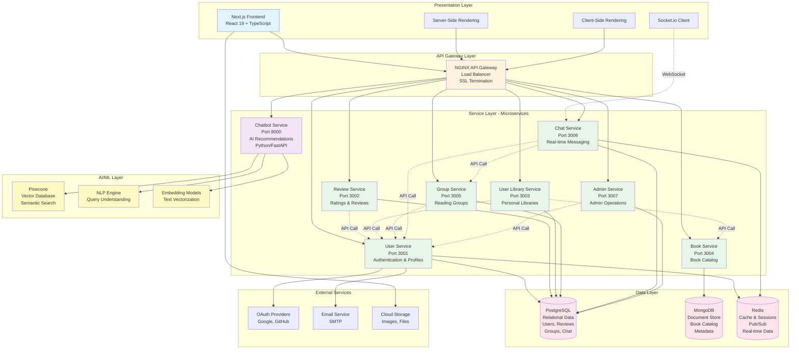
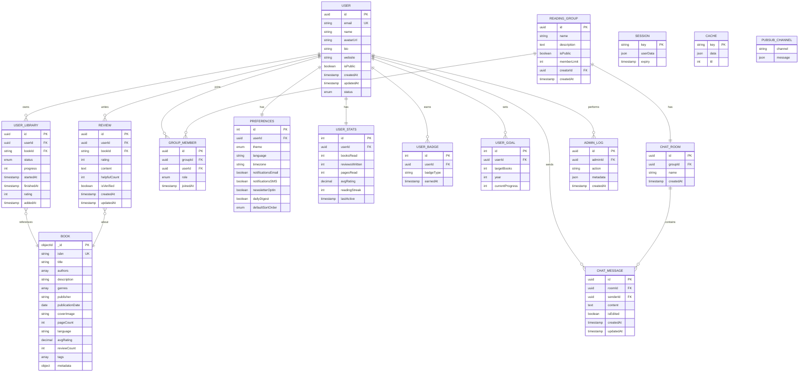
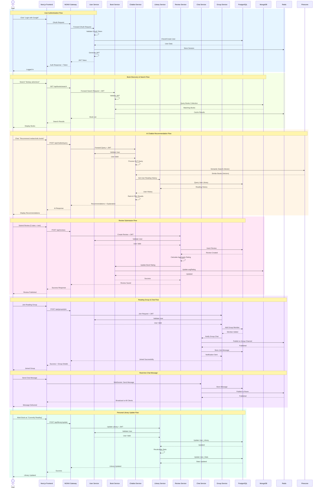

# ShelfSpace Capstone Project - Mermaid Diagrams

## Figure 1: System Architecture



---

## Figure 2: Database Design



---

## Figure 3: Service Interaction Flow



---

## Figure 4: Frontend Architecture

```mermaid
graph TB
    subgraph "Next.js Application Structure"
        direction TB

        subgraph "App Router (src/app/)"
            HOME[/home<br/>Landing Page]
            AUTH[/auth<br/>Login/Register]
            BOOKS[/books<br/>Book Discovery]
            BOOK_DETAIL[/books/id<br/>Book Details]
            LIBRARY[/library<br/>My Library]
            GROUPS[/groups<br/>Reading Groups]
            GROUP_DETAIL[/groups/id<br/>Group Page]
            PROFILE[/profile<br/>User Profile]
            CHAT[/chat<br/>Messaging]
            ADMIN[/admin<br/>Admin Dashboard]
        end

        subgraph "Components (src/components/)"
            direction TB

            subgraph "Layout Components"
                HEADER[Header<br/>Navigation & Auth]
                FOOTER[Footer<br/>Links & Info]
                SIDEBAR[Sidebar<br/>Filters & Menu]
            end

            subgraph "Feature Components"
                BOOK_CARD[BookCard<br/>Book Display]
                REVIEW_CARD[ReviewCard<br/>Review Display]
                CHAT_BOT[ChatBot<br/>AI Assistant]
                CHAT_MESSAGE[ChatMessage<br/>Message Bubble]
                GROUP_CARD[GroupCard<br/>Group Display]
                LIBRARY_SHELF[LibraryShelf<br/>Book Organization]
                RATING[RatingStars<br/>Star Rating]
                SEARCH[SearchBar<br/>Search Input]
            end

            subgraph "Form Components"
                REVIEW_FORM[ReviewForm<br/>Submit Review]
                GROUP_FORM[GroupForm<br/>Create Group]
                PROFILE_FORM[ProfileForm<br/>Edit Profile]
                CHAT_INPUT[ChatInput<br/>Message Input]
            end

            subgraph "UI Components"
                BUTTON[Button<br/>Styled Buttons]
                MODAL[Modal<br/>Dialogs]
                LOADING[Loading<br/>Spinners]
                TOAST[Toast<br/>Notifications]
                CARD[Card<br/>Container]
                BADGE[Badge<br/>Labels]
            end
        end

        subgraph "Hooks (src/hooks/)"
            USE_AUTH[useAuth<br/>Auth State]
            USE_BOOKS[useBooks<br/>Book Data]
            USE_REVIEWS[useReviews<br/>Review Data]
            USE_CHAT[useChat<br/>Chat State]
            USE_LIBRARY[useLibrary<br/>Library State]
            USE_SOCKET[useSocket<br/>WebSocket]
        end

        subgraph "Services (src/services/)"
            AUTH_SVC[authService<br/>Authentication API]
            BOOK_SVC[bookService<br/>Book API]
            REVIEW_SVC[reviewService<br/>Review API]
            LIBRARY_SVC[libraryService<br/>Library API]
            GROUP_SVC[groupService<br/>Group API]
            CHAT_SVC[chatService<br/>Chat API]
            CHATBOT_SVC[chatbotService<br/>AI API]
            ADMIN_SVC[adminService<br/>Admin API]
        end

        subgraph "Context Providers (src/context/)"
            AUTH_CTX[AuthContext<br/>User Session]
            THEME_CTX[ThemeContext<br/>UI Theme]
            SOCKET_CTX[SocketContext<br/>WebSocket Conn]
            NOTIF_CTX[NotificationContext<br/>Alerts]
        end

        subgraph "Utilities (src/lib/)"
            AXIOS[Axios Config<br/>HTTP Client]
            SOCKET_IO[Socket.io Client<br/>WebSocket]
            VALIDATORS[Validators<br/>Form Validation]
            FORMATTERS[Formatters<br/>Data Format]
            CONSTANTS[Constants<br/>Config Values]
        end

        subgraph "Styling (src/styles/)"
            GLOBALS[globals.css<br/>Global Styles]
            TAILWIND[tailwind.config.js<br/>Tailwind Setup]
            THEME[theme.ts<br/>Design Tokens]
        end

        subgraph "Configuration"
            NEXT_CONFIG[next.config.js<br/>Next.js Config]
            TS_CONFIG[tsconfig.json<br/>TypeScript Config]
            ENV[.env.local<br/>Environment Vars]
            PACKAGE[package.json<br/>Dependencies]
        end
    end

    subgraph "External Integrations"
        NEXTAUTH[NextAuth.js<br/>OAuth Provider]
        SOCKETIO_SERVER[Socket.io Server<br/>Chat Service]
        API_GATEWAY[NGINX Gateway<br/>Backend APIs]
    end

    %% Page to Component Connections
    HOME --> HEADER
    HOME --> BOOK_CARD
    HOME --> SEARCH
    HOME --> FOOTER

    BOOKS --> HEADER
    BOOKS --> SIDEBAR
    BOOKS --> BOOK_CARD
    BOOKS --> SEARCH

    BOOK_DETAIL --> HEADER
    BOOK_DETAIL --> REVIEW_CARD
    BOOK_DETAIL --> REVIEW_FORM
    BOOK_DETAIL --> RATING

    LIBRARY --> HEADER
    LIBRARY --> LIBRARY_SHELF
    LIBRARY --> BOOK_CARD

    GROUPS --> HEADER
    GROUPS --> GROUP_CARD
    GROUPS --> GROUP_FORM

    GROUP_DETAIL --> HEADER
    GROUP_DETAIL --> CHAT_MESSAGE
    GROUP_DETAIL --> CHAT_INPUT

    CHAT --> HEADER
    CHAT --> CHAT_BOT
    CHAT --> CHAT_MESSAGE
    CHAT --> CHAT_INPUT

    PROFILE --> HEADER
    PROFILE --> PROFILE_FORM

    %% Component to Hook Connections
    HEADER --> USE_AUTH
    BOOK_CARD --> USE_LIBRARY
    REVIEW_FORM --> USE_REVIEWS
    CHAT_BOT --> USE_CHAT
    CHAT_MESSAGE --> USE_SOCKET
    LIBRARY_SHELF --> USE_LIBRARY
    SEARCH --> USE_BOOKS

    %% Hook to Service Connections
    USE_AUTH --> AUTH_SVC
    USE_BOOKS --> BOOK_SVC
    USE_REVIEWS --> REVIEW_SVC
    USE_LIBRARY --> LIBRARY_SVC
    USE_CHAT --> CHAT_SVC
    USE_CHAT --> CHATBOT_SVC
    USE_SOCKET --> CHAT_SVC

    %% Service to External Connections
    AUTH_SVC --> AXIOS
    AUTH_SVC --> NEXTAUTH
    BOOK_SVC --> AXIOS
    REVIEW_SVC --> AXIOS
    LIBRARY_SVC --> AXIOS
    GROUP_SVC --> AXIOS
    CHAT_SVC --> SOCKET_IO
    CHATBOT_SVC --> AXIOS
    ADMIN_SVC --> AXIOS

    AXIOS --> API_GATEWAY
    SOCKET_IO --> SOCKETIO_SERVER

    %% Context Usage
    AUTH_CTX --> USE_AUTH
    SOCKET_CTX --> USE_SOCKET
    THEME_CTX --> GLOBALS
    NOTIF_CTX --> TOAST

    %% Styling
    TAILWIND --> GLOBALS
    THEME --> TAILWIND

    %% Configuration
    NEXT_CONFIG --> ENV
    TS_CONFIG --> PACKAGE

    style HOME fill:#e3f2fd
    style BOOKS fill:#e3f2fd
    style BOOK_DETAIL fill:#e3f2fd
    style LIBRARY fill:#e3f2fd
    style GROUPS fill:#e3f2fd
    style GROUP_DETAIL fill:#e3f2fd
    style CHAT fill:#e3f2fd
    style PROFILE fill:#e3f2fd

    style HEADER fill:#f3e5f5
    style FOOTER fill:#f3e5f5
    style SIDEBAR fill:#f3e5f5

    style BOOK_CARD fill:#e8f5e9
    style REVIEW_CARD fill:#e8f5e9
    style CHAT_BOT fill:#e8f5e9
    style GROUP_CARD fill:#e8f5e9

    style USE_AUTH fill:#fff3e0
    style USE_BOOKS fill:#fff3e0
    style USE_CHAT fill:#fff3e0

    style AUTH_SVC fill:#fce4ec
    style BOOK_SVC fill:#fce4ec
    style CHAT_SVC fill:#fce4ec
```

---

## How to Use These Diagrams

### Option 1: Mermaid Live Editor (Online)
1. Go to https://mermaid.live/
2. Copy one of the diagram codes above
3. Paste it into the editor
4. The diagram will render automatically
5. Click "Actions" → "Download PNG" or "Download SVG"

### Option 2: VS Code Extension
1. Install "Markdown Preview Mermaid Support" extension
2. Create a new `.md` file
3. Paste the diagram code inside triple backticks with `mermaid` language identifier
4. Preview the file (Ctrl+Shift+V)
5. Right-click → Export to PNG/SVG

### Option 3: Insert into Word Document
1. Render the diagram using Mermaid Live Editor
2. Download as PNG or SVG (PNG recommended for Word)
3. Open your capstone.doc file
4. Insert → Picture → Select downloaded image
5. Add figure caption below

### Diagram Sizes Recommendation
- **Figure 1 (System Architecture)**: Large - Full page width
- **Figure 2 (Database Design)**: Large - Full page width
- **Figure 3 (Service Interaction)**: Extra Large - May need landscape orientation
- **Figure 4 (Frontend Architecture)**: Large - Full page width

---

## Notes
- All diagrams are designed to match the content in your capstone document
- Colors are used to differentiate layers/components
- Diagrams follow standard architectural diagram conventions
- All service ports and technologies match your actual implementation
- Database relationships and inter-service communications are accurately depicted
