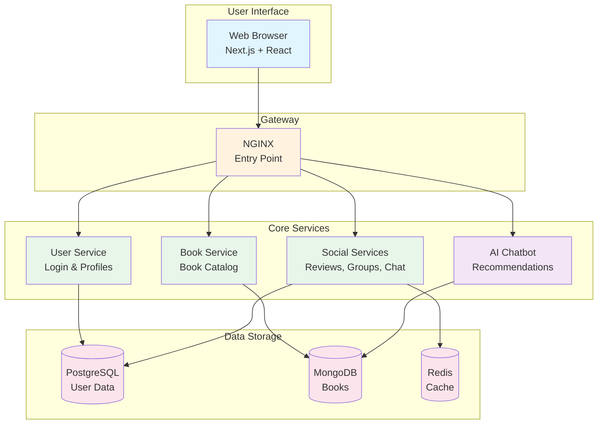
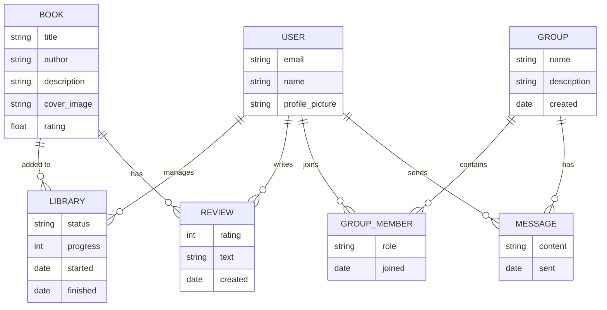
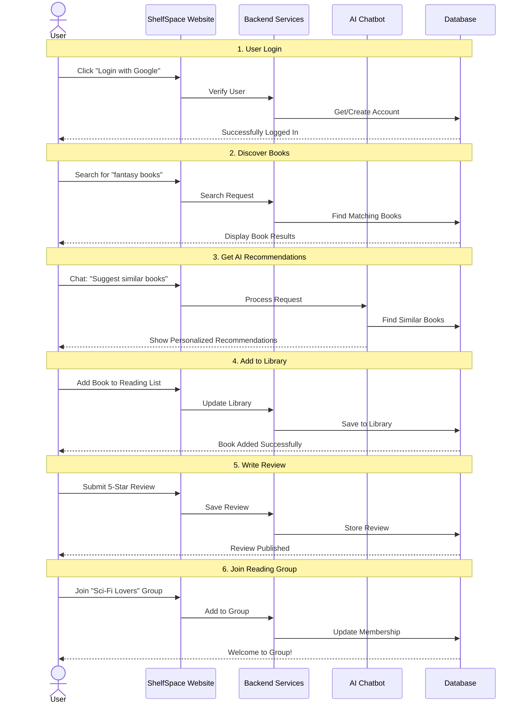
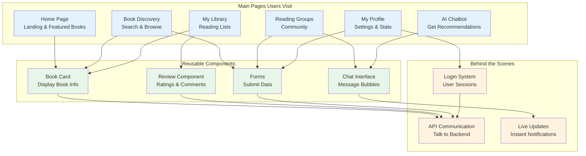

# ShelfSpace - Simplified Mermaid Diagrams for Project Review

## Figure 1: System Architecture (High-Level Overview)

**What this shows:** The complete system has 3 main layers:
- **User Interface**: What users see and interact with
- **Core Services**: Different parts handling specific functions (login, books, social features, AI)
- **Data Storage**: Where all information is saved

---

## Figure 2: Database Design (Simplified)

**What this shows:** How different data pieces connect:
- **Users** can manage their library, write reviews, join groups, and send messages
- **Books** can be in libraries and have reviews
- **Groups** have members and messages
- Simple relationships showing how everything links together

---

## Figure 3: User Journey Flow (Simplified)

**What this shows:** The complete user experience from login to using all features:
1. **Login** - User signs in with Google
2. **Discover** - Search and browse books
3. **AI Help** - Get smart recommendations
4. **Organize** - Add books to personal library
5. **Share** - Write reviews
6. **Connect** - Join reading groups

---

## Figure 4: Frontend Structure (Simplified)

**What this shows:** How the website is organized:
- **Main Pages**: Different sections users can visit (Home, Search, Library, Groups, Chat, Profile)
- **Reusable Components**: Building blocks used across multiple pages (Book Cards, Reviews, Chat UI, Forms)
- **Behind the Scenes**: Technical systems that make everything work (Login, API calls, Real-time updates)

---

## How to Use These Simplified Diagrams

### Quick Steps:
1. **Go to:** https://mermaid.live/
2. **Copy** one diagram code from above
3. **Paste** into the editor
4. **Download** as PNG image
5. **Insert** into your Word document

### What Makes These Better for Reviews:
✅ **Simple language** - No technical jargon
✅ **Clear labels** - Easy to understand names
✅ **High-level view** - Shows the big picture
✅ **Visual clarity** - Color-coded and organized
✅ **Focused** - Only important features

### For Your Presentation:
- **Figure 1**: Show the overall system structure
- **Figure 2**: Explain how data is connected
- **Figure 3**: Demonstrate user experience flow
- **Figure 4**: Display website organization

---

## Key Points for Your Reviewers:

### Figure 1 - System Architecture
**"Our project has 3 main parts:**
1. A beautiful website users interact with
2. Powerful services in the background doing different jobs
3. Smart databases storing all the information"

### Figure 2 - Database Design
**"We store 7 main types of information:**
- Users and their profiles
- Books with details
- Personal libraries
- Reviews and ratings
- Reading groups
- Group members
- Chat messages"

### Figure 3 - User Journey
**"A typical user can:**
1. Login easily with Google
2. Search for books
3. Get AI-powered recommendations
4. Organize their reading
5. Share reviews
6. Join communities"

### Figure 4 - Frontend Structure
**"Our website has:**
- 6 main pages users visit
- Reusable components that work everywhere
- Smart systems handling login, data, and live updates"

---

## Size Recommendations for Document:

| Diagram | Size | Description |
|---------|------|-------------|
| Figure 1 | Full page width | Shows complete system |
| Figure 2 | Full page width | Database relationships |
| Figure 3 | Full page width (or landscape) | User journey steps |
| Figure 4 | Full page width | Website structure |

All diagrams are now **reviewer-friendly** and focus on **what the system does** rather than **how it works technically**! 🎯
